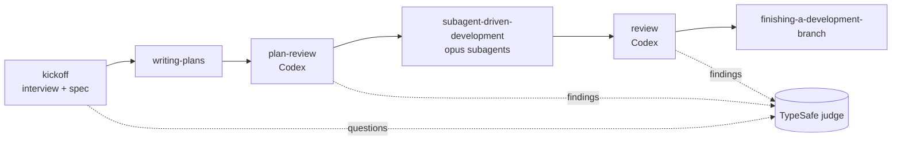

# claude-skills

A personal skills distro for [Claude Code](https://docs.anthropic.com/claude-code) and [Codex](https://github.com/openai/codex): one opinionated workflow assembled from the best skills of several open-source collections, kept in sync with their upstreams, with local patches on top.

## Why a distro instead of plugins

- **One flow, one place.** Skills from different authors are wired to call each other by name; the routing lives in `USING.md`, injected into every session by a SessionStart hook.
- **Patched copies, not forks.** Upstream skills are vendored into `vendor/`, three-way merged into `skills/`, and our edits are recorded in `patches/`. A weekly GitHub Action opens a PR when upstream changes.
- **Decisions by probability.** Multiple-choice questions are sent to the TypeSafe judge (Jev). High-confidence answers are accepted automatically and printed with their probabilities; low-confidence ones are asked.
- **A second voice.** Plans and branches are reviewed by Codex (through Orca when available), never only by the agent that wrote them.

## The flow



```
kickoff → writing-plans → plan-review → subagent-driven-development → review → finishing-a-development-branch
   │                          │  ▲                   │                  │
   │                          ├──┘ 1 re-review       │                  │
   │                          │                      └ per-task reviews │
   └─ questions → TypeSafe    └─ findings → TypeSafe                    └ findings → TypeSafe, 1 fix wave, 1 re-review
```

| Step | Skill | What happens |
|---|---|---|
| 1 | `kickoff` | Classifies the task, interviews through a decision tree, judges each multiple-choice question, writes `docs/specs/<date>-<topic>-design.md` with a Decisions section. |
| 2 | `writing-plans` | Bite-sized TDD plan in `docs/plans/<date>-<name>.md`. |
| 3 | `plan-review` | Codex reviews the plan (architecture, quality, tests, performance) and writes the report next to the plan as `<plan-name>.review.md` (the plan's basename without `.md`). Findings rated 7+/10 are judged, the plan is revised, one re-review. |
| 4 | `subagent-driven-development` | Fresh `opus` subagent per task, spec + quality review after each. |
| 5 | `review` | Codex reviews the whole diff against plan and spec; report in `docs/reviews/`. At most one fix subagent, at most one re-review, then the hand-off to step 6. |
| 6 | `finishing-a-development-branch` | Merge, PR, or keep. |

Outside the flow: `systematic-debugging`, `test-driven-development`, `verification-before-completion`, `typesafe-ai`.

### `review` outside the flow

`review` also runs on its own, with three scopes and two modes:

| Argument | Scope |
|---|---|
| *(none)* | the branch diff against the merge base with `main` (or against a commit passed as the argument) |
| `<paths\|globs>` | those tracked files, reviewed whole, no diff |
| `all` | every tracked text file, minus `vendor/`, `node_modules/`, `docs/reviews/`, `.superpowers/`, `.context/` and lockfiles |

A **clean** working tree gives full mode: review → findings judged → at most one fix wave and one re-review; each round's report is committed as soon as it is written. In branch scope it then hands off to `finishing-a-development-branch`; path and codebase scope end with the summary. A **dirty** working tree gives report-only mode, so the skill is usable mid-task: findings are still judged and printed, but no fix subagent runs and nothing is committed.

### Decisions and reviewers

- The judge is `scripts/typesafe-judge.mjs` (TypeSafe SDK, model Jev). The acceptance threshold lives in `config/judge.json` (default `0.7`) and the key is read from `TYPESAFE_API_KEY`. Every auto-accepted answer is printed in chat as a decision block with the options and their probabilities. When the judge is unavailable the script exits `2` and the skill asks the user instead of guessing.
- The external reviewer is `scripts/reviewer.sh`: Orca-managed Codex when `orca status` answers, otherwise `codex exec`. If neither is available it exits `3` and the calling skill falls back to an unnamed background Claude subagent on `opus`.

## Skills

| Skill | Type | Source | Author | License |
|---|---|---|---|---|
| `kickoff` | own | inspired by [superpowers brainstorming](https://github.com/obra/superpowers) and [mattpocock grilling](https://github.com/mattpocock/skills) | this repo | MIT |
| `plan-review` | own | methodology from [gstack plan-eng-review](https://github.com/garrytan/gstack) (watched) | this repo | MIT |
| `review` | own | prompt from [superpowers requesting-code-review](https://github.com/obra/superpowers) (watched) | this repo | MIT |
| `writing-plans` | copy + patch | [obra/superpowers](https://github.com/obra/superpowers) | Jesse Vincent | MIT |
| `subagent-driven-development` | copy + patch | obra/superpowers | Jesse Vincent | MIT |
| `systematic-debugging` | copy + patch | obra/superpowers | Jesse Vincent | MIT |
| `test-driven-development` | copy + patch | obra/superpowers | Jesse Vincent | MIT |
| `finishing-a-development-branch` | copy | obra/superpowers | Jesse Vincent | MIT |
| `verification-before-completion` | copy | obra/superpowers | Jesse Vincent | MIT |
| `typesafe-ai` | copy | [typesafe-ai/skills](https://github.com/typesafe-ai/skills) | TypeSafe AI | MIT |

Patches: `superpowers:*` references point at this distro's skill names, no git-worktree steps (work happens in Orca worktrees), all subagents on `opus`, SDD's final review routed to `review`, docs under `docs/specs/` and `docs/plans/`; `test-driven-development` only has its citations rewritten. Full attribution is in `NOTICE`.

## Install

Requirements: Node 20+, git, `codex` CLI (logged in), optional Orca CLI, a TypeSafe API key.

```bash
git clone https://github.com/VerusK/claude-skills.git && cd claude-skills
make install
```

`make install` symlinks every skill into `~/.claude/skills/` and `~/.codex/skills/`, adds a SessionStart hook to `~/.claude/settings.json` that runs `scripts/session-start.mjs` to inject `USING.md`, adds a pointer line to `~/.codex/AGENTS.md`, and uninstalls the `superpowers` plugin (its skills are vendored here). It then reports whether `TYPESAFE_API_KEY`, `codex` and `orca` are present. Names already taken in the target directories by something that is not ours are skipped, never overwritten.

Pass installer flags through `make install` with `ARGS`, or call the script directly:

```bash
make install ARGS="--skip-plugin"              # keep the superpowers plugin installed
node scripts/install.mjs --home /tmp/sandbox   # install into another HOME (used by the tests)
node scripts/install.mjs --skip-plugin         # same as make install ARGS="--skip-plugin"
node scripts/install.mjs --uninstall           # same as make uninstall
node scripts/install.mjs --force                # install the symlinks even though the plugin is installed
```

Re-installing from a second checkout of this repo (a fresh clone, or the old one moved away) re-points the existing symlinks, SessionStart hook and `AGENTS.md` line at the new checkout and reports them as `re-pointed from <old checkout>`, instead of leaving duplicates behind.

Codex model and reasoning effort used by `plan-review` / `review` live in `config/reviewer.json` (default `gpt-6-astra`, `high`); override per run with `REVIEWER_CODEX_MODEL` / `REVIEWER_CODEX_REASONING`.

Put the TypeSafe key where Claude Code sees it, in `~/.claude/settings.json`:

```json
"env": { "TYPESAFE_API_KEY": "ts_..." }
```

For Codex also `export TYPESAFE_API_KEY=...` in `~/.zshenv`.

Remove old collections that this distro replaces — gstack, compound-engineering and superpowers leftovers in Claude and Codex:

```bash
make cleanup
```

It asks before each group, backs up `~/.codex/config.toml` and `~/.claude/settings.json` before editing them, follows symlinked config files instead of replacing the symlink, and reports anything it could not remove.

Preview it first: `bash scripts/cleanup.sh < /dev/null` lists every group and removes nothing (EOF counts as no). `bash scripts/cleanup.sh --yes` answers yes to all — use it only after a preview.

## Update

```bash
make sync      # fetch upstreams, 3-way merge into skills/, refresh patches/ and sources.lock.json
make repatch   # after editing a vendored skill by hand, re-record the diff in patches/
make test      # node --test tests/*.test.mjs
```

`make sync` merges file by file with `git merge-file`: base is the old `vendor/` copy, ours is `skills/`, theirs is the new upstream. Clean merges land in `skills/`; a conflict leaves `<<<<<<< ours` markers in the file and the run exits non-zero; a file `git merge-file` cannot handle (binaries) is listed as *merge error, local copy kept*. `patches/` is a regenerated record of our divergence, never replayed onto upstream, and `sources.lock.json` records the commit, content hash and sync time of each source.

The `sync upstream skills` workflow does the same weekly (Mondays 06:00 UTC) and on demand, opening a PR on `sync/upstream` with `.sync-report.md` as its body and the `sync` label. One-time repo setting: enable *Settings → Actions → General → Workflow permissions → Allow GitHub Actions to create and approve pull requests*, or the PR step fails. PRs opened with the default token do not trigger the `test` workflow, so the sync job runs `npm test` itself and records the result in the PR body (`## Tests`) and the `tests-failing` label. Conflicts and merge errors add the `needs-attention` label; resolve the markers, run `make repatch`, merge.

Watch-only sources (`mode: watch` in `sources.yaml`) are only tracked in `vendor/`, never merged into `skills/`: `gstack-plan-eng-review` (`plan-eng-review/SKILL.md.tmpl` from garrytan/gstack) and `superpowers-code-reviewer` (`skills/requesting-code-review/code-reviewer.md` from obra/superpowers). Their diffs appear in the PR body; our own prompts derived from them are updated by hand.

This repo's own spec and plan live under `docs/superpowers/` for historical reasons; in target repos the skills write to `docs/specs/` and `docs/plans/`.

## Add a source

Append to `sources.yaml`:

```yaml
  - name: my-skill
    repo: owner/repo
    ref: main
    path: skills/my-skill
    patch: true      # only if you intend to edit the copy
```

Run `make sync`, edit `skills/my-skill/` if needed, `make repatch`, commit.

## Uninstall

```bash
make uninstall   # removes symlinks, hook and AGENTS.md line
```

## License

MIT — see [`LICENSE`](LICENSE). Upstream attribution is in `NOTICE`.
