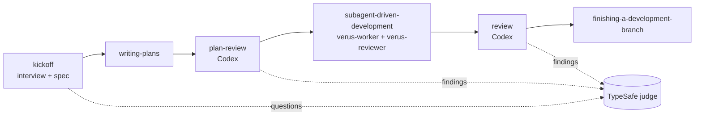

# claude-skills

A personal skills distro for [Claude Code](https://docs.anthropic.com/claude-code) and [Codex](https://github.com/openai/codex): one opinionated workflow assembled from the best skills of several open-source collections, kept in sync with their upstreams, with local patches on top.

## Two ways to install

The distro ships as the `verus-skills` plugin and also installs by symlink from a
checkout. The plugin is the normal path: updates arrive through
`claude plugin update`. The symlink install is the development path: edits in the
checkout are live with no release. They are mutually exclusive — the symlink
installer refuses to run while the plugin is installed, because both ship the
same ten skills, the same three agents and the same SessionStart hook.

- **One flow, one place.** Skills from different authors are wired to call each
  other by name; the routing lives in `USING.md`, injected into every session by a
  SessionStart hook. Under the plugin the skills are addressed
  `verus-skills:<name>`; under the symlink install, by the bare name.
- **Patched copies, not forks.** Upstream skills are vendored into `vendor/`,
  three-way merged into `skills/`, and our edits are recorded in `patches/`. A
  weekly GitHub Action opens a PR when upstream changes.
- **Decisions by probability.** Multiple-choice questions are sent to the TypeSafe
  judge (Jev). High-confidence answers are accepted automatically and printed with
  their probabilities; low-confidence ones are asked.
- **A second voice.** Plans and branches are reviewed by Codex (through Orca when
  available), never only by the agent that wrote them.

## The flow



```
kickoff → writing-plans → plan-review → subagent-driven-development → review → finishing-a-development-branch
   │                          │  ▲                   │                  │
   │                          ├──┘ 1 re-review       │                  │
   │                          │                      └ per-task reviews │
   └─ questions → TypeSafe    └─ findings → TypeSafe                    └ findings → TypeSafe, 1 fix wave, 1 re-review
```

| Step | Skill | What happens |
|---|---|---|
| 1 | `kickoff` | Classifies the task, interviews through a decision tree, judges each multiple-choice question, writes `docs/specs/<date>-<topic>-design.md` with a Decisions section. |
| 2 | `writing-plans` | Bite-sized TDD plan in `docs/plans/<date>-<name>.md`. |
| 3 | `plan-review` | Codex reviews the plan (architecture, quality, tests, performance) and writes the report next to the plan as `<plan-name>.review.md` (the plan's basename without `.md`). Findings rated 7+/10 are judged, the plan is revised, one re-review. |
| 4 | `subagent-driven-development` | Fresh `verus-worker` subagent per task, a `verus-reviewer` spec + quality review after each. |
| 5 | `review` | Codex reviews the whole diff against plan and spec; report in `docs/reviews/`. At most one fix subagent, at most one re-review, then the hand-off to step 6. |
| 6 | `finishing-a-development-branch` | Merge, PR, or keep. |

Outside the flow: `systematic-debugging`, `test-driven-development`, `verification-before-completion`, `typesafe-ai`.

### `review` outside the flow

`review` also runs on its own, with three scopes and two modes:

| Argument | Scope |
|---|---|
| *(none)* | the branch diff against the merge base with `main` (or against a commit passed as the argument) |
| `<paths\|globs>` | those tracked files, reviewed whole, no diff |
| `all` | every tracked text file, minus `vendor/`, `vendor-node/`, `node_modules/`, `docs/reviews/`, `.superpowers/`, `.context/` and lockfiles |

A **clean** working tree gives full mode: review → findings judged → at most one fix wave and one re-review; each round's report is committed as soon as it is written. In branch scope it then hands off to `finishing-a-development-branch`; path and codebase scope end with the summary. A **dirty** working tree gives report-only mode, so the skill is usable mid-task: findings are still judged and printed, but no fix subagent runs and nothing is committed.

### Decisions and reviewers

- The judge is `scripts/typesafe-judge.mjs` (TypeSafe SDK, model Jev). The acceptance threshold lives in `config/judge.json` (default `0.7`, overridable with `--threshold`). The key comes from `TYPESAFE_API_KEY`, else from `typesafe.apiKey` in `~/.verus-skills/config.json`; the model is `judge.model` (see [Models and effort](#models-and-effort)). A second gate guards against confidence built on a thin context: the judge also rates how well the supplied facts support any choice, and an answer is auto-accepted only when that sufficiency clears `sufficiencyThreshold` (default `0.6` in the same file, overridable with `--sufficiency`); otherwise the question goes to the user marked `(мало данных)`. Every auto-accepted answer is printed in chat as a decision block with the options, their probabilities and both numbers. When the judge is unavailable the script exits `2` and the skill asks the user instead of guessing.
- The external reviewer is `scripts/reviewer.sh`: Orca-managed Codex when `orca status` answers, otherwise `codex exec`, with the Codex model and effort from [Models and effort](#models-and-effort). On the Orca path a report counts as finished only once its last line is `<!-- end of review -->`, which both reviewer prompts require. If neither is available it exits `3` and the calling skill falls back to the `verus-reviewer` agent, dispatched unnamed and in the background.

## Skills

| Skill | Type | Source | Author | License |
|---|---|---|---|---|
| `kickoff` | own | inspired by [superpowers brainstorming](https://github.com/obra/superpowers) and [mattpocock grilling](https://github.com/mattpocock/skills) | this repo | MIT |
| `plan-review` | own | methodology from [gstack plan-eng-review](https://github.com/garrytan/gstack) (watched) | this repo | MIT |
| `review` | own | prompt from [superpowers requesting-code-review](https://github.com/obra/superpowers) (watched) | this repo | MIT |
| `writing-plans` | copy + patch | [obra/superpowers](https://github.com/obra/superpowers) | Jesse Vincent | MIT |
| `subagent-driven-development` | copy + patch | obra/superpowers | Jesse Vincent | MIT |
| `systematic-debugging` | copy + patch | obra/superpowers | Jesse Vincent | MIT |
| `test-driven-development` | copy + patch | obra/superpowers | Jesse Vincent | MIT |
| `finishing-a-development-branch` | copy | obra/superpowers | Jesse Vincent | MIT |
| `verification-before-completion` | copy | obra/superpowers | Jesse Vincent | MIT |
| `typesafe-ai` | copy | [typesafe-ai/skills](https://github.com/typesafe-ai/skills) | TypeSafe AI | MIT |

Patches: `superpowers:*` references point at this distro's skill names, no git-worktree steps (work happens in Orca worktrees), every subagent dispatched as a `verus-*` agent type (see [Models and effort](#models-and-effort)), SDD's final review routed to `review`, docs under `docs/specs/` and `docs/plans/`; `test-driven-development` only has its citations rewritten. Full attribution is in `NOTICE`.

## Models and effort

Every model and effort setting lives in `config/models.json`:

```json
{
  "subagents": {
    "worker":   { "model": "opus", "effort": "high" },
    "reviewer": { "model": "opus", "effort": "xhigh" },
    "explorer": { "model": "opus", "effort": "medium" }
  },
  "codex": { "model": "default", "reasoning": "default" },
  "judge": { "model": "jev-latest" }
}
```

- **Claude subagents** run as the agent types `verus-worker` (implementers, fix waves), `verus-reviewer` (task reviews, re-reviews, plan reviews, the fallback external reviewer) and `verus-explorer` (kickoff lookups); `make install` links them into `~/.claude/agents/`, the plugin ships them. After editing `subagents`, run `make models` — it rewrites the `model:`/`effort:` lines of `agents/verus-*.md`; a test fails if they drift. The symlink install sees the change at once; the plugin after a release. Effort: `low|medium|high|xhigh|max`.
- **The `opus` alias** follows the newest Opus only when the main session is not itself pinned to an older Opus: a session on an older Opus keeps its subagents on that exact version. To pin, write a full model id (e.g. `claude-opus-5-6`) and run `make models`.
- **Codex reviewer:** `default` passes no `-m`/`model_reasoning_effort`, so Codex uses `~/.codex/config.toml`. Override per run with `REVIEWER_CODEX_MODEL` / `REVIEWER_CODEX_REASONING`. Every Codex value must be a single token (letters, digits, `_ . : [ ] -`); anything else stops the review with an error that names the setting, never its value. Each review starts a fresh Codex terminal, so a change applies from the next review.
- **Judge:** `jev-latest` by default; override per run with `TYPESAFE_DEFAULT_MODEL`.
- **Per machine**, without a commit: `~/.verus-skills/config.json` may set `codex.model`, `codex.reasoning` and `judge.model`; it wins over `config/models.json`, env wins over both. A Claude subagent's model cannot be overridden per run — agent definitions are static.

## Install

### As a plugin (recommended)

```bash
claude plugin marketplace add VerusK/claude-skills
claude plugin install verus-skills@verus-skills
```

Then restart Claude Code. Update with `claude plugin update verus-skills@verus-skills`.

For Codex:

```bash
codex plugin marketplace add VerusK/claude-skills
codex plugin add verus-skills@verus-skills
```

These write the same sections you could add to `~/.codex/config.toml` by hand
(`[marketplaces.verus-skills]` with `source_type = "git"` and
`[plugins."verus-skills@verus-skills"]` with `enabled = true`). Refresh the
marketplace snapshot with `codex plugin marketplace upgrade verus-skills`.

Codex runs a plugin's hooks only after you trust them: the first interactive
`codex` start after installing shows **Hooks need review** — trust the
`verus-skills` SessionStart hook there. Until then the hook does not run (and
`codex exec` skips untrusted hooks silently), so the session gets no routing
block and no `~/.verus-skills/root` pointer.

Where the judge's SDK comes from: Claude Code runs `npm install` for a plugin
with dependencies, so its plugin cache has `node_modules`. Codex does not, so
under Codex the judge loads the copy vendored in `vendor-node/`.

The plugin cannot uninstall another plugin, so if `superpowers` is still
installed — its skills are vendored here — remove it yourself:

```bash
claude plugin uninstall superpowers@claude-plugins-official
```

The SessionStart hook writes the distro root to `~/.verus-skills/root`; the
skills read that file to find `scripts/typesafe-judge.mjs` and
`scripts/reviewer.sh`, because neither `CLAUDE_PLUGIN_ROOT` nor
`CLAUDE_SKILL_DIR` reaches a skill's shell calls.

### From a checkout (development)

Requirements: Node 20+, git, `codex` CLI (logged in), optional Orca CLI, a TypeSafe API key.

```bash
git clone https://github.com/VerusK/claude-skills.git && cd claude-skills
make install
```

`make install` symlinks every skill into `~/.claude/skills/` and `~/.codex/skills/`, links the three agent types (`verus-worker.md`, `verus-reviewer.md`, `verus-explorer.md` from `agents/`) into `~/.claude/agents/`, adds a SessionStart hook to `~/.claude/settings.json` that runs `scripts/session-start.mjs` to inject `USING.md`, adds a pointer line to `~/.codex/AGENTS.md`, and uninstalls the `superpowers` plugin (its skills are vendored here). It then reports whether a TypeSafe API key (`TYPESAFE_API_KEY` or `~/.verus-skills/config.json`), `codex` and `orca` are present.

Skill names and agent names are treated differently when something else already holds them:

- A **skill name** taken in `~/.claude/skills/` or `~/.codex/skills/` by something that is not ours is skipped with a `SKIPPED` line and never overwritten; the rest of the install goes on.
- An **agent name** in `~/.claude/agents/` held by a regular file, or by a link to an existing file outside this checkout and outside every other checkout of the distro, stops the install before anything is written — even with `--force`, because the skills would dispatch to that foreign agent. Move it away and re-run. A dangling link on an agent name is replaced and reported as `replaced dangling link`.

Pass installer flags through `make install` with `ARGS`, or call the script directly:

```bash
make install ARGS="--skip-plugin"              # keep the superpowers plugin installed
node scripts/install.mjs --home /tmp/sandbox   # install into another HOME (used by the tests)
node scripts/install.mjs --skip-plugin         # same as make install ARGS="--skip-plugin"
node scripts/install.mjs --uninstall           # same as make uninstall
node scripts/install.mjs --force                # install even though the plugin is installed (never overrides an agent-name collision)
```

Re-installing from a second checkout of this repo (a fresh clone, or the old one moved away) re-points the existing skill and agent symlinks, SessionStart hook and `AGENTS.md` line at the new checkout and reports them as `re-pointed from <old checkout>`, instead of leaving duplicates behind.

Models and effort for every layer — Claude subagents, the Codex reviewer, the judge — are set as described in [Models and effort](#models-and-effort).

Put the TypeSafe key in `~/.verus-skills/config.json` — one place for Claude Code and Codex, outside every repo, kept across plugin updates. If the file does not exist yet, create it readable only by you from the first byte (`umask 077`), and refuse to overwrite one that exists (`set -C`):

```bash
mkdir -p ~/.verus-skills
(umask 077; set -C; printf '{ "typesafe": { "apiKey": "ts_..." } }\n' > ~/.verus-skills/config.json)
```

If the file already exists (it may hold your `codex` or `judge` overrides), the command above stops with an error (`file exists` in zsh, `cannot overwrite existing file` in bash) and changes nothing. Open the file in an editor instead and add `"typesafe": { "apiKey": "ts_..." }` as one more key of its top-level JSON object, keeping everything else; then run `chmod 600 ~/.verus-skills/config.json` if it is readable by group or others.

`TYPESAFE_API_KEY` in the environment still works and wins over the file. The judge warns when the file is readable by group or others. `config/models.json` refuses any secret-like field, so a key can never be committed.

Remove old collections that this distro replaces — gstack, compound-engineering and superpowers leftovers in Claude and Codex:

```bash
make cleanup
```

It asks before each group, backs up `~/.codex/config.toml` and `~/.claude/settings.json` before editing them, follows symlinked config files instead of replacing the symlink, and reports anything it could not remove.

Preview it first: `bash scripts/cleanup.sh < /dev/null` lists every group and removes nothing (EOF counts as no). `bash scripts/cleanup.sh --yes` answers yes to all — use it only after a preview.

## Update

```bash
make sync      # fetch upstreams, 3-way merge into skills/, refresh patches/ and sources.lock.json
make repatch   # after editing a vendored skill by hand, re-record the diff in patches/
make test      # node --test tests/*.test.mjs
```

`make sync` merges file by file with `git merge-file`: base is the old `vendor/` copy, ours is `skills/`, theirs is the new upstream. Clean merges land in `skills/`; a conflict leaves `<<<<<<< ours` markers in the file and the run exits non-zero; a file `git merge-file` cannot handle (binaries) is listed as *merge error, local copy kept*. `patches/` is a regenerated record of our divergence, never replayed onto upstream, and `sources.lock.json` records the commit, content hash and sync time of each source.

The `sync upstream skills` workflow does the same weekly (Mondays 06:00 UTC) and on demand, opening a PR on `sync/upstream` with `.sync-report.md` as its body and the `sync` label. One-time repo setting: enable *Settings → Actions → General → Workflow permissions → Allow GitHub Actions to create and approve pull requests*, or the PR step fails. PRs opened with the default token do not trigger the `test` workflow, so the sync job runs `npm test` itself and records the result in the PR body (`## Tests`) and the `tests-failing` label. Conflicts and merge errors add the `needs-attention` label; resolve the markers, run `make repatch`, merge.

Watch-only sources (`mode: watch` in `sources.yaml`) are only tracked in `vendor/`, never merged into `skills/`: `gstack-plan-eng-review` (`plan-eng-review/SKILL.md.tmpl` from garrytan/gstack) and `superpowers-code-reviewer` (`skills/requesting-code-review/code-reviewer.md` from obra/superpowers). Their diffs appear in the PR body; our own prompts derived from them are updated by hand.

This repo's own spec and plan live under `docs/superpowers/` for historical reasons; in target repos the skills write to `docs/specs/` and `docs/plans/`.

## Add a source

Append to `sources.yaml`:

```yaml
  - name: my-skill
    repo: owner/repo
    ref: main
    path: skills/my-skill
    patch: true      # only if you intend to edit the copy
```

Run `make sync`, edit `skills/my-skill/` if needed, `make repatch`, commit.

## Release

One version lives in `package.json`, `.claude-plugin/plugin.json`,
`.codex-plugin/plugin.json` and the marketplace entry; a test fails if they
disagree.

```bash
make release BUMP=patch    # or minor, major, or an explicit X.Y.Z
```

It refuses to start on a dirty tracked tree. It bumps the four manifests, lets
npm rewrite `package-lock.json`, runs the suite, commits, and tags the release
with `claude plugin tag`, which re-checks that `plugin.json` and the marketplace
entry agree.

It stops there. Nothing reaches `claude plugin update` until the tag is pushed,
which stays a separate, deliberate step:

```bash
git push --follow-tags
```

The vendored TypeSafe SDK under `vendor-node/` is what the judge imports inside
the plugin cache, where `node_modules` does not exist. After changing the
dependency in `package.json`, run `npm install && make vendor-sdk` and commit the
result; a test compares the vendored version against `package-lock.json`.

## Uninstall

```bash
make uninstall   # removes symlinks, hook and AGENTS.md line
```

For the plugin install:

```bash
claude plugin uninstall verus-skills@verus-skills
claude plugin marketplace remove verus-skills
rm -f ~/.verus-skills/root   # keeps config.json and its key
```

For Codex:

```bash
codex plugin remove verus-skills@verus-skills
codex plugin marketplace remove verus-skills
```

Older versions kept one Orca terminal per repo in `.context/plan-review-session` / `.context/review-session`. They are no longer used; close those terminals in Orca and delete the files if they are still there.

These drop the `[marketplaces.verus-skills]` and
`[plugins."verus-skills@verus-skills"]` sections from `~/.codex/config.toml`;
the symlink installer refuses while the plugin section is there.

Reinstalling the symlinks with `make install` also uninstalls the `superpowers`
plugin by default; pass `make install ARGS="--skip-plugin"` to keep it.

## License

MIT — see [`LICENSE`](LICENSE). Upstream attribution is in `NOTICE`.
