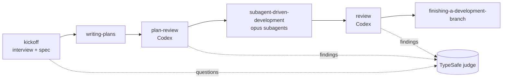

# Skills Distro Implementation Plan

> **For agentic workers:** REQUIRED SUB-SKILL: Use superpowers:subagent-driven-development (recommended) or superpowers:executing-plans to implement this plan task-by-task. Steps use checkbox (`- [ ]`) syntax for tracking.

**Goal:** Turn `claude-skills` into a self-updating personal skills distro for Claude Code and Codex: own `kickoff` / `plan-review` / `review` skills, vendored superpowers and TypeSafe skills with local patches, a TypeSafe judge for auto-answering multiple-choice questions, and an installer that replaces the superpowers plugin, gstack and compound-engineering.

**Architecture:** Flat `skills/<name>/` directory symlinked into `~/.claude/skills` and `~/.codex/skills`. External skills are fetched from GitHub tarballs into `vendor/<name>/`, then three-way merged into `skills/<name>/` with `git merge-file` (base = previous vendor, ours = skills, theirs = new vendor); `patches/<name>.patch` is a human-readable record regenerated by `make repatch`. Three Node scripts (`sync.mjs`, `install.mjs`, `typesafe-judge.mjs`) plus two bash scripts (`reviewer.sh`, `cleanup.sh`). A weekly GitHub Action opens a sync PR.

**Tech Stack:** Node 20+ (ESM, built-in `node:test`), `@typesafe-ai/sdk` ^0.6.0, `yaml` ^2, bash, git, `tar`, GitHub Actions (`peter-evans/create-pull-request`).

**Spec:** `docs/superpowers/specs/2026-09-22-skills-distro-design.md`

## Global Constraints

- Node `>= 20`; no dependencies beyond `@typesafe-ai/sdk` and `yaml`.
- Skills live one level deep: `skills/<name>/SKILL.md`. No nested skill dirs.
- Subagents dispatched by any skill in this repo use `model: opus` (user's global rule).
- Subagents are dispatched unnamed and in the background (never as named teammates that open their own windows); the controller only collects their reports.
- Auto-accepting an answer without a successful judge call is forbidden; judge failure (exit 2) always falls back to asking the user.
- `reviewer.sh` exit codes: `0` report written, `3` no external reviewer available, `1` usage error.
- Spec paths: specs go to `docs/specs/`, plans to `docs/plans/` (patched into vendored skills).
- Codex sandbox cannot read outside the repo: every reviewer prompt embeds the plan/diff content and reads only files inside the repo.
- Cleanup never runs from inside Claude Code (global `rm` deny); it is a script the user runs.
- All upstream sources are MIT; attribution goes to `NOTICE` and README.
- Commit after every task with a conventional-commit message and the `Co-Authored-By: Claude Fable 5.1 <noreply@anthropic.com>` trailer.

## File Structure

```
claude-skills/
  README.md, NOTICE, USING.md, CLAUDE.md, Makefile, package.json, .gitignore
  sources.yaml, sources.lock.json
  config/judge.json
  scripts/
    typesafe-judge.mjs   # stdin JSON -> stdout JSON (choice, probabilities, confidence, accepted, block)
    sync.mjs             # sources.yaml -> vendor/ + skills/ (3-way merge) + lock + patches
    install.mjs          # symlinks, SessionStart hook, ~/.codex/AGENTS.md line, uninstall
    session-start.mjs    # prints USING.md as hookSpecificOutput JSON
    reviewer.sh          # Orca -> codex exec -> exit 3
    cleanup.sh           # removes gstack / compound-engineering / superpowers leftovers
  skills/
    kickoff/SKILL.md
    plan-review/{SKILL.md,reviewer.md}
    review/{SKILL.md,reviewer.md}
    writing-plans/, subagent-driven-development/, finishing-a-development-branch/,
    test-driven-development/, verification-before-completion/, systematic-debugging/,
    typesafe-ai/                       # vendored (synced)
  vendor/<name>/          # pristine upstream copies (incl. watch-only sources)
  patches/<name>.patch    # diff -ruN vendor/<name> skills/<name>
  tests/*.test.mjs
  .github/workflows/sync.yml
  docs/superpowers/{specs,plans}/
```

---

### Task 1: Repo scaffold, remove old code-review

**Files:**
- Create: `package.json`, `Makefile`, `config/judge.json`, `tests/smoke.test.mjs`
- Modify: `.gitignore`, `CLAUDE.md`
- Delete: `code-review/` (whole directory)

**Interfaces:**
- Produces: `npm test` runs `node --test tests/*.test.mjs`; `config/judge.json` shape `{ "threshold": 0.7 }`.

- [ ] **Step 1: Write the failing smoke test**

`tests/smoke.test.mjs`:
```js
import { test } from "node:test";
import assert from "node:assert/strict";
import { readFileSync } from "node:fs";

test("config/judge.json has a numeric threshold in (0,1]", () => {
  const cfg = JSON.parse(readFileSync(new URL("../config/judge.json", import.meta.url), "utf8"));
  assert.equal(typeof cfg.threshold, "number");
  assert.ok(cfg.threshold > 0 && cfg.threshold <= 1);
});
```

- [ ] **Step 2: Run it, expect failure**

Run: `node --test tests/*.test.mjs`
Expected: FAIL, `ENOENT ... config/judge.json`

- [ ] **Step 3: Create scaffold files**

`package.json`:
```json
{
  "name": "claude-skills",
  "version": "1.0.0",
  "private": true,
  "type": "module",
  "engines": { "node": ">=20" },
  "scripts": {
    "test": "node --test tests/*.test.mjs",
    "sync": "node scripts/sync.mjs",
    "repatch": "node scripts/sync.mjs --repatch",
    "install-skills": "node scripts/install.mjs",
    "uninstall-skills": "node scripts/install.mjs --uninstall"
  },
  "dependencies": {
    "@typesafe-ai/sdk": "^0.6.0",
    "yaml": "^2.5.0"
  }
}
```

`config/judge.json`:
```json
{ "threshold": 0.7 }
```

`Makefile`:
```make
.PHONY: install uninstall sync repatch cleanup test deps

deps:
	npm install --no-audit --no-fund

install: deps
	node scripts/install.mjs

uninstall:
	node scripts/install.mjs --uninstall

sync: deps
	node scripts/sync.mjs

repatch:
	node scripts/sync.mjs --repatch

cleanup:
	bash scripts/cleanup.sh

test: deps
	node --test tests/*.test.mjs
```

Append to `.gitignore`:
```
node_modules/
.context/
```

Replace `CLAUDE.md`:
```markdown
# claude-skills

Personal skills distro for Claude Code and Codex. See README.md for the flow and USING.md for routing.

## Layout

- `skills/<name>/SKILL.md` — installable skills (flat, one level deep)
- `vendor/<name>/` — pristine upstream copies; never edit by hand
- `patches/<name>.patch` — record of local edits, regenerated by `make repatch`
- `scripts/` — sync, install, judge, reviewer launcher, cleanup
- `sources.yaml` — upstream sources; `sources.lock.json` — pinned commits

## Rules

- Edit vendored skills only in `skills/<name>/`, then run `make repatch`.
- Subagents dispatched by skills here use `model: opus`.
- Run `npm test` before committing script changes.
```

Delete: `git rm -r code-review`

- [ ] **Step 4: Install deps and run the test**

Run: `npm install --no-audit --no-fund && node --test tests/*.test.mjs`
Expected: PASS (1 test). If `@typesafe-ai/sdk@^0.6.0` does not resolve, check `npm view @typesafe-ai/sdk versions` and pin the newest 0.x; note the version in the commit message.

- [ ] **Step 5: Commit**

```bash
git add -A
git commit -m "chore: scaffold distro repo, drop legacy code-review skill"
```

---

### Task 2: TypeSafe judge script

**Files:**
- Create: `scripts/typesafe-judge.mjs`, `tests/judge.test.mjs`

**Interfaces:**
- Produces: `judge(input, { client, choice, threshold })` → `{ choice, probabilities, confidence, threshold, accepted, block }`; CLI reads JSON on stdin, writes JSON on stdout, exit `0` ok, `2` judge unavailable/invalid input.
- Input shape: `{ question: string, options: [{ id, label, description? }], context?: string, recommended?: string }`.

- [ ] **Step 1: Write failing tests**

`tests/judge.test.mjs`:
```js
import { test } from "node:test";
import assert from "node:assert/strict";
import { judge, validate, buildState, buildQuestions, formatDecision } from "../scripts/typesafe-judge.mjs";

const input = {
  question: "Where to store the API key?",
  options: [
    { id: "A", label: "settings.json env", description: "global Claude settings" },
    { id: "B", label: "~/.zshenv" },
  ],
  context: "macOS, Claude Code + Codex",
  recommended: "A",
};

const fakeChoice = (q, criteria) => ({ type: "choice", q, criteria });

function fakeClient(answer) {
  return { systemOne: async () => ({ answers: { answer } }) };
}

test("validate rejects missing options", () => {
  assert.throws(() => validate({ question: "x", options: [{ id: "A", label: "a" }] }), /2\.\.6 options/);
});

test("buildQuestions maps option ids to descriptions", () => {
  const q = buildQuestions(input, fakeChoice);
  assert.equal(q.answer.q, input.question);
  assert.deepEqual(Object.keys(q.answer.criteria), ["A", "B"]);
  assert.match(q.answer.criteria.A, /settings\.json env: global Claude settings/);
});

test("buildState carries context and recommendation", () => {
  const s = buildState(input);
  assert.equal(s.recommended, "A");
  assert.match(s.options, /A\. settings\.json env/);
});

test("judge accepts above threshold", async () => {
  const r = await judge(input, {
    client: fakeClient({ type: "choice", choice: "A", confidence: 0.82, probabilities: { A: 0.9, B: 0.1 } }),
    choice: fakeChoice,
    threshold: 0.7,
  });
  assert.equal(r.choice, "A");
  assert.equal(r.accepted, true);
  assert.equal(r.threshold, 0.7);
  assert.match(r.block, /Выбрано: A/);
  assert.match(r.block, /принято автоматически/);
});

test("judge rejects below threshold", async () => {
  const r = await judge(input, {
    client: fakeClient({ type: "choice", choice: "B", confidence: 0.3, probabilities: { A: 0.4, B: 0.6 } }),
    choice: fakeChoice,
    threshold: 0.7,
  });
  assert.equal(r.accepted, false);
  assert.match(r.block, /спросить пользователя/);
});

test("formatDecision lists every option with percent", () => {
  const block = formatDecision(input, { choice: "A", probabilities: { A: 0.82, B: 0.18 }, confidence: 0.64, threshold: 0.7, accepted: false });
  assert.match(block, /A\. settings\.json env\s+82%/);
  assert.match(block, /B\. ~\/\.zshenv\s+18%/);
});
```

- [ ] **Step 2: Run tests, expect failure**

Run: `node --test tests/judge.test.mjs`
Expected: FAIL, cannot find module `scripts/typesafe-judge.mjs`

- [ ] **Step 3: Implement the script**

`scripts/typesafe-judge.mjs`:
```js
#!/usr/bin/env node
// Probabilistic judge for multiple-choice questions via TypeSafe (Jev).
// stdin: {question, options:[{id,label,description?}], context?, recommended?}
// stdout: {choice, probabilities, confidence, threshold, accepted, block}
// exit 0 ok; exit 2 judge unavailable or invalid input (caller must ask the user).
import { readFileSync } from "node:fs";
import path from "node:path";
import { fileURLToPath } from "node:url";

const HERE = path.dirname(fileURLToPath(import.meta.url));
export const REPO_ROOT = path.resolve(HERE, "..");

export function loadConfig(configPath = path.join(REPO_ROOT, "config", "judge.json")) {
  return JSON.parse(readFileSync(configPath, "utf8"));
}

export function validate(input) {
  if (!input || typeof input.question !== "string" || !input.question.trim()) {
    throw new Error("input.question must be a non-empty string");
  }
  if (!Array.isArray(input.options) || input.options.length < 2 || input.options.length > 6) {
    throw new Error("input.options must have 2..6 options");
  }
  for (const o of input.options) {
    if (!o || typeof o.id !== "string" || typeof o.label !== "string") {
      throw new Error("each option needs string id and label");
    }
  }
  const ids = new Set(input.options.map((o) => o.id));
  if (ids.size !== input.options.length) throw new Error("option ids must be unique");
}

function optionLine(o) {
  return `${o.id}. ${o.label}${o.description ? ` — ${o.description}` : ""}`;
}

export function buildQuestions(input, choice) {
  const criteria = {};
  for (const o of input.options) {
    criteria[o.id] = o.description ? `${o.label}: ${o.description}` : o.label;
  }
  return { answer: choice(input.question, criteria) };
}

export function buildState(input) {
  return {
    question: input.question,
    options: input.options.map(optionLine).join("\n"),
    context: input.context ?? "",
    recommended: input.recommended ?? "",
  };
}

export function formatDecision(input, result) {
  const pct = (v) => `${Math.round((v ?? 0) * 100)}%`;
  const width = Math.max(...input.options.map((o) => optionLine(o).length));
  const lines = input.options.map((o) => `  ${optionLine(o).padEnd(width)}  ${pct(result.probabilities[o.id])}`);
  const verdict = result.accepted ? "принято автоматически" : "спросить пользователя";
  return [
    `Решение (Jev): ${input.question}`,
    ...lines,
    `  Выбрано: ${result.choice}, confidence ${result.confidence.toFixed(2)}, порог ${result.threshold} → ${verdict}`,
  ].join("\n");
}

export async function judge(input, { client, choice, threshold }) {
  validate(input);
  const response = await client.systemOne({
    state: buildState(input),
    questions: buildQuestions(input, choice),
  });
  const a = response?.answers?.answer;
  if (!a || typeof a.choice !== "string" || typeof a.confidence !== "number" || !a.probabilities) {
    throw new Error("unexpected SDK response shape");
  }
  const result = {
    choice: a.choice,
    probabilities: a.probabilities,
    confidence: a.confidence,
    threshold,
    accepted: a.confidence >= threshold,
  };
  result.block = formatDecision(input, result);
  return result;
}

async function main() {
  const args = process.argv.slice(2);
  const t = args.indexOf("--threshold");
  const threshold = t >= 0 ? Number(args[t + 1]) : loadConfig().threshold;
  if (!Number.isFinite(threshold)) {
    console.error("invalid threshold");
    process.exit(2);
  }
  if (!process.env.TYPESAFE_API_KEY) {
    console.error("TYPESAFE_API_KEY is not set; judge unavailable");
    process.exit(2);
  }
  let input;
  try {
    input = JSON.parse(readFileSync(0, "utf8"));
  } catch {
    console.error("stdin must be a JSON object");
    process.exit(2);
  }
  try {
    const { TypeSafeClient, choice } = await import("@typesafe-ai/sdk");
    const client = new TypeSafeClient();
    const result = await judge(input, { client, choice, threshold });
    process.stdout.write(JSON.stringify(result) + "\n");
  } catch (err) {
    console.error(`judge failed: ${err.message}`);
    process.exit(2);
  }
}

if (process.argv[1] && path.resolve(process.argv[1]) === fileURLToPath(import.meta.url)) {
  main();
}
```

- [ ] **Step 4: Run tests**

Run: `node --test tests/judge.test.mjs`
Expected: PASS (6 tests)

- [ ] **Step 5: CLI smoke without key**

Run: `echo '{}' | node scripts/typesafe-judge.mjs; echo "exit=$?"`
Expected: stderr `TYPESAFE_API_KEY is not set; judge unavailable`, `exit=2`

- [ ] **Step 6: Commit**

```bash
git add scripts/typesafe-judge.mjs tests/judge.test.mjs
git commit -m "feat: add TypeSafe judge script for multiple-choice decisions"
```

---

### Task 3: Sync engine (`scripts/sync.mjs`)

**Files:**
- Create: `scripts/sync.mjs`, `tests/sync.test.mjs`, `sources.yaml`

**Interfaces:**
- Produces: `parseSources(yamlText)` → `[{ name, repo, ref, path, mode: "merge"|"watch", patch: boolean }]`; `syncSource(source, { root, fetchSource })` → `{ name, commit, changed, conflicts: string[], added: string[], removed: string[], kept: string[], diff?: string }`; `repatch(source, { root })` → path or null; `writeLock`, `readLock`; CLI `node scripts/sync.mjs [--only name] [--repatch]`, exit `1` if any conflicts.
- `fetchSource(source)` → `{ dir: string, commit: string }` where `dir` is an extracted tarball root; default implementation uses `git ls-remote` + GitHub codeload tarball.

- [ ] **Step 1: Write failing tests**

`tests/sync.test.mjs`:
```js
import { test } from "node:test";
import assert from "node:assert/strict";
import { mkdtempSync, mkdirSync, writeFileSync, readFileSync, existsSync } from "node:fs";
import { tmpdir } from "node:os";
import path from "node:path";
import { execFileSync } from "node:child_process";
import { parseSources, syncSource, repatch, readLock } from "../scripts/sync.mjs";

function setupRoot() {
  const root = mkdtempSync(path.join(tmpdir(), "sync-"));
  execFileSync("git", ["init", "-q"], { cwd: root });
  mkdirSync(path.join(root, "skills"));
  mkdirSync(path.join(root, "vendor"));
  mkdirSync(path.join(root, "patches"));
  return root;
}

function upstream(files) {
  const dir = mkdtempSync(path.join(tmpdir(), "up-"));
  for (const [rel, content] of Object.entries(files)) {
    mkdirSync(path.dirname(path.join(dir, rel)), { recursive: true });
    writeFileSync(path.join(dir, rel), content);
  }
  return dir;
}

const src = { name: "demo", repo: "x/y", ref: "main", path: "skills/demo", mode: "merge", patch: true };
const fetcher = (dir, commit) => async () => ({ dir, commit });

test("parseSources normalises defaults", () => {
  const list = parseSources(`sources:\n  - name: a\n    repo: o/r\n    path: skills/a\n  - name: w\n    repo: o/r\n    path: f.md\n    mode: watch\n`);
  assert.deepEqual(list[0], { name: "a", repo: "o/r", ref: "main", path: "skills/a", mode: "merge", patch: false });
  assert.equal(list[1].mode, "watch");
});

test("first sync copies upstream into vendor and skills", async () => {
  const root = setupRoot();
  const up = upstream({ "skills/demo/SKILL.md": "v1\n", "skills/demo/extra.md": "e\n" });
  const r = await syncSource(src, { root, fetchSource: fetcher(up, "aaa") });
  assert.equal(r.commit, "aaa");
  assert.deepEqual(r.added.sort(), ["SKILL.md", "extra.md"]);
  assert.equal(readFileSync(path.join(root, "skills/demo/SKILL.md"), "utf8"), "v1\n");
  assert.equal(readFileSync(path.join(root, "vendor/demo/SKILL.md"), "utf8"), "v1\n");
  assert.equal(readLock(root).demo.commit, "aaa");
});

test("upstream change merges into locally patched file", async () => {
  const root = setupRoot();
  await syncSource(src, { root, fetchSource: fetcher(upstream({ "skills/demo/SKILL.md": "line1\nline2\nline3\n" }), "a") });
  writeFileSync(path.join(root, "skills/demo/SKILL.md"), "line1\nOURS\nline3\n");
  const r = await syncSource(src, { root, fetchSource: fetcher(upstream({ "skills/demo/SKILL.md": "line1\nline2\nline3\nTHEIRS\n" }), "b") });
  assert.deepEqual(r.conflicts, []);
  assert.equal(readFileSync(path.join(root, "skills/demo/SKILL.md"), "utf8"), "line1\nOURS\nline3\nTHEIRS\n");
  assert.equal(readFileSync(path.join(root, "vendor/demo/SKILL.md"), "utf8"), "line1\nline2\nline3\nTHEIRS\n");
});

test("conflicting change leaves markers and reports conflict", async () => {
  const root = setupRoot();
  await syncSource(src, { root, fetchSource: fetcher(upstream({ "skills/demo/SKILL.md": "a\nb\nc\n" }), "a") });
  writeFileSync(path.join(root, "skills/demo/SKILL.md"), "a\nOURS\nc\n");
  const r = await syncSource(src, { root, fetchSource: fetcher(upstream({ "skills/demo/SKILL.md": "a\nTHEIRS\nc\n" }), "b") });
  assert.deepEqual(r.conflicts, ["SKILL.md"]);
  assert.match(readFileSync(path.join(root, "skills/demo/SKILL.md"), "utf8"), /<<<<<<< ours/);
});

test("file deleted upstream is removed when unmodified, kept when modified", async () => {
  const root = setupRoot();
  await syncSource(src, { root, fetchSource: fetcher(upstream({ "skills/demo/SKILL.md": "s\n", "skills/demo/gone.md": "g\n", "skills/demo/mod.md": "m\n" }), "a") });
  writeFileSync(path.join(root, "skills/demo/mod.md"), "m-ours\n");
  const r = await syncSource(src, { root, fetchSource: fetcher(upstream({ "skills/demo/SKILL.md": "s\n" }), "b") });
  assert.deepEqual(r.removed, ["gone.md"]);
  assert.deepEqual(r.kept, ["mod.md"]);
  assert.ok(!existsSync(path.join(root, "skills/demo/gone.md")));
  assert.ok(existsSync(path.join(root, "skills/demo/mod.md")));
});

test("watch mode updates vendor only and returns a diff", async () => {
  const root = setupRoot();
  const w = { name: "w", repo: "x/y", ref: "main", path: "f.md", mode: "watch", patch: false };
  await syncSource(w, { root, fetchSource: fetcher(upstream({ "f.md": "one\n" }), "a") });
  const r = await syncSource(w, { root, fetchSource: fetcher(upstream({ "f.md": "two\n" }), "b") });
  assert.equal(r.changed, true);
  assert.match(r.diff, /-one/);
  assert.match(r.diff, /\+two/);
  assert.ok(!existsSync(path.join(root, "skills/w")));
  assert.equal(readFileSync(path.join(root, "vendor/w/f.md"), "utf8"), "two\n");
});

test("repatch writes a diff when skills differ from vendor, removes it when identical", async () => {
  const root = setupRoot();
  await syncSource(src, { root, fetchSource: fetcher(upstream({ "skills/demo/SKILL.md": "x\n" }), "a") });
  assert.equal(repatch(src, { root }), null);
  writeFileSync(path.join(root, "skills/demo/SKILL.md"), "y\n");
  const p = repatch(src, { root });
  assert.equal(p, path.join(root, "patches/demo.patch"));
  assert.match(readFileSync(p, "utf8"), /\+y/);
});
```

- [ ] **Step 2: Run tests, expect failure**

Run: `node --test tests/sync.test.mjs`
Expected: FAIL, cannot find module `scripts/sync.mjs`

- [ ] **Step 3: Implement sync.mjs**

`scripts/sync.mjs`:
```js
#!/usr/bin/env node
// Sync external skills from GitHub into vendor/ and three-way merge into skills/.
import { execFileSync, spawnSync } from "node:child_process";
import {
  existsSync, mkdirSync, mkdtempSync, readFileSync, writeFileSync, rmSync, cpSync,
  readdirSync, statSync, unlinkSync,
} from "node:fs";
import { createHash } from "node:crypto";
import { tmpdir } from "node:os";
import path from "node:path";
import { fileURLToPath } from "node:url";
import YAML from "yaml";

const HERE = path.dirname(fileURLToPath(import.meta.url));
export const REPO_ROOT = path.resolve(HERE, "..");

export function parseSources(text) {
  const doc = YAML.parse(text);
  if (!doc || !Array.isArray(doc.sources)) throw new Error("sources.yaml must contain a 'sources' list");
  return doc.sources.map((s) => {
    for (const k of ["name", "repo", "path"]) {
      if (typeof s[k] !== "string" || !s[k]) throw new Error(`source is missing '${k}'`);
    }
    return { name: s.name, repo: s.repo, ref: s.ref ?? "main", path: s.path, mode: s.mode === "watch" ? "watch" : "merge", patch: s.patch === true };
  });
}

export function readLock(root) {
  const p = path.join(root, "sources.lock.json");
  return existsSync(p) ? JSON.parse(readFileSync(p, "utf8")) : {};
}

export function writeLock(root, lock) {
  writeFileSync(path.join(root, "sources.lock.json"), JSON.stringify(lock, null, 2) + "\n");
}

function listFiles(dir, base = dir) {
  if (!existsSync(dir)) return [];
  const out = [];
  for (const entry of readdirSync(dir)) {
    const full = path.join(dir, entry);
    if (statSync(full).isDirectory()) out.push(...listFiles(full, base));
    else out.push(path.relative(base, full));
  }
  return out.sort();
}

export function hashTree(dir) {
  const h = createHash("sha256");
  for (const rel of listFiles(dir)) {
    h.update(rel + "\0");
    h.update(readFileSync(path.join(dir, rel)));
    h.update("\0");
  }
  return h.digest("hex");
}

function sameContent(a, b) {
  return existsSync(a) && existsSync(b) && readFileSync(a).equals(readFileSync(b));
}

function copyFile(from, to) {
  mkdirSync(path.dirname(to), { recursive: true });
  cpSync(from, to);
}

// Returns number of conflicts (0 = clean). Writes result into `ours`.
function mergeFile(ours, base, theirs) {
  const r = spawnSync("git", ["merge-file", "-L", "ours", "-L", "base", "-L", "upstream", ours, base, theirs]);
  if (r.status === null || r.status < 0) throw new Error(`git merge-file failed: ${r.stderr}`);
  return r.status; // git returns the number of conflicts
}

function diffDirs(a, b) {
  const r = spawnSync("git", ["diff", "--no-index", "--", a, b], { encoding: "utf8" });
  return r.stdout ?? "";
}

// Default fetcher: resolve ref to a commit, download tarball, extract.
export async function fetchFromGitHub(source) {
  const ls = execFileSync("git", ["ls-remote", `https://github.com/${source.repo}.git`, source.ref], { encoding: "utf8" });
  const commit = ls.trim().split(/\s+/)[0] || source.ref;
  const work = mkdtempSync(path.join(tmpdir(), `skills-${source.name}-`));
  const tar = path.join(work, "src.tar.gz");
  const res = await fetch(`https://codeload.github.com/${source.repo}/tar.gz/${commit}`);
  if (!res.ok) throw new Error(`download failed for ${source.repo}@${commit}: ${res.status}`);
  writeFileSync(tar, Buffer.from(await res.arrayBuffer()));
  const dir = path.join(work, "tree");
  mkdirSync(dir);
  execFileSync("tar", ["-xzf", tar, "-C", dir, "--strip-components=1"]);
  return { dir, commit };
}

// Stage the upstream `path` into a fresh dir shaped like vendor/<name>.
function stageUpstream(source, fetched) {
  const src = path.join(fetched.dir, source.path);
  if (!existsSync(src)) throw new Error(`${source.name}: path '${source.path}' not found in ${source.repo}@${fetched.commit}`);
  const staged = mkdtempSync(path.join(tmpdir(), `stage-${source.name}-`));
  if (statSync(src).isDirectory()) cpSync(src, staged, { recursive: true });
  else copyFile(src, path.join(staged, path.basename(src)));
  return staged;
}

export async function syncSource(source, { root = REPO_ROOT, fetchSource = fetchFromGitHub } = {}) {
  const fetched = await fetchSource(source);
  const staged = stageUpstream(source, fetched);
  const vendorDir = path.join(root, "vendor", source.name);
  const skillDir = path.join(root, "skills", source.name);
  const result = { name: source.name, commit: fetched.commit, mode: source.mode, changed: false, conflicts: [], added: [], removed: [], kept: [] };

  const oldHash = existsSync(vendorDir) ? hashTree(vendorDir) : null;
  const newHash = hashTree(staged);
  result.changed = oldHash !== newHash;

  if (source.mode === "watch") {
    if (result.changed && oldHash) result.diff = diffDirs(vendorDir, staged);
  } else {
    const newFiles = listFiles(staged);
    const oldFiles = listFiles(vendorDir);
    for (const rel of newFiles) {
      const theirs = path.join(staged, rel);
      const base = path.join(vendorDir, rel);
      const ours = path.join(skillDir, rel);
      if (!existsSync(ours)) {
        copyFile(theirs, ours);
        result.added.push(rel);
      } else if (!existsSync(base)) {
        result.kept.push(rel); // local file with no upstream history: keep ours
      } else if (sameContent(base, theirs)) {
        // upstream unchanged
      } else if (sameContent(base, ours)) {
        copyFile(theirs, ours); // we never modified it
      } else if (mergeFile(ours, base, theirs) > 0) {
        result.conflicts.push(rel);
      }
    }
    for (const rel of oldFiles) {
      if (newFiles.includes(rel)) continue;
      const ours = path.join(skillDir, rel);
      if (!existsSync(ours)) continue;
      if (sameContent(path.join(vendorDir, rel), ours)) {
        unlinkSync(ours);
        result.removed.push(rel);
      } else {
        result.kept.push(rel);
      }
    }
  }

  rmSync(vendorDir, { recursive: true, force: true });
  cpSync(staged, vendorDir, { recursive: true });

  const lock = readLock(root);
  lock[source.name] = { repo: source.repo, ref: source.ref, path: source.path, commit: fetched.commit, hash: newHash, syncedAt: new Date().toISOString() };
  writeLock(root, lock);
  return result;
}

export function repatch(source, { root = REPO_ROOT } = {}) {
  const vendorDir = path.join(root, "vendor", source.name);
  const skillDir = path.join(root, "skills", source.name);
  const out = path.join(root, "patches", `${source.name}.patch`);
  mkdirSync(path.dirname(out), { recursive: true });
  const r = spawnSync("diff", ["-ruN", path.relative(root, vendorDir), path.relative(root, skillDir)], { cwd: root, encoding: "utf8" });
  if (r.status === 0) {
    if (existsSync(out)) unlinkSync(out);
    return null;
  }
  if (r.status !== 1) throw new Error(`diff failed for ${source.name}: ${r.stderr}`);
  writeFileSync(out, r.stdout);
  return out;
}

function summarize(results) {
  const lines = ["# Sync report", ""];
  for (const r of results) {
    const state = r.conflicts.length ? "CONFLICTS" : r.changed ? "updated" : "unchanged";
    lines.push(`## ${r.name} — ${state} (${r.commit.slice(0, 7)})`);
    if (r.added.length) lines.push(`- added: ${r.added.join(", ")}`);
    if (r.removed.length) lines.push(`- removed: ${r.removed.join(", ")}`);
    if (r.kept.length) lines.push(`- kept local (upstream deleted or unknown): ${r.kept.join(", ")}`);
    if (r.conflicts.length) lines.push(`- conflicts (markers left in skills/${r.name}): ${r.conflicts.join(", ")}`);
    if (r.diff) lines.push("", "```diff", r.diff.trim(), "```");
    lines.push("");
  }
  return lines.join("\n");
}

async function main() {
  const args = process.argv.slice(2);
  const only = args.includes("--only") ? args[args.indexOf("--only") + 1] : null;
  const sources = parseSources(readFileSync(path.join(REPO_ROOT, "sources.yaml"), "utf8")).filter((s) => !only || s.name === only);

  if (args.includes("--repatch")) {
    for (const s of sources.filter((s) => s.patch)) {
      const p = repatch(s, { root: REPO_ROOT });
      console.log(`${s.name}: ${p ? path.relative(REPO_ROOT, p) : "no local changes"}`);
    }
    return;
  }

  const results = [];
  for (const s of sources) {
    try {
      const r = await syncSource(s, { root: REPO_ROOT });
      results.push(r);
      if (s.patch) repatch(s, { root: REPO_ROOT });
    } catch (err) {
      results.push({ name: s.name, commit: "-", changed: false, conflicts: [`sync error: ${err.message}`], added: [], removed: [], kept: [] });
    }
  }
  const report = summarize(results);
  writeFileSync(path.join(REPO_ROOT, ".sync-report.md"), report);
  console.log(report);
  process.exit(results.some((r) => r.conflicts.length) ? 1 : 0);
}

if (process.argv[1] && path.resolve(process.argv[1]) === fileURLToPath(import.meta.url)) {
  main();
}
```

Add `.sync-report.md` to `.gitignore`.

- [ ] **Step 4: Run tests**

Run: `node --test tests/sync.test.mjs`
Expected: PASS (7 tests). If the merge test fails because `git merge-file` output differs, print the file and adjust expected text; the semantics (ours kept, upstream appended) must hold.

- [ ] **Step 5: Write `sources.yaml`**

```yaml
# External skills. `mode: merge` (default) syncs into skills/<name>/ via 3-way merge;
# `mode: watch` only tracks upstream in vendor/<name>/ and reports diffs.
# `patch: true` marks sources with local edits; `make repatch` records them in patches/.
sources:
  - name: writing-plans
    repo: obra/superpowers
    ref: main
    path: skills/writing-plans
    patch: true
  - name: subagent-driven-development
    repo: obra/superpowers
    ref: main
    path: skills/subagent-driven-development
    patch: true
  - name: finishing-a-development-branch
    repo: obra/superpowers
    ref: main
    path: skills/finishing-a-development-branch
  - name: test-driven-development
    repo: obra/superpowers
    ref: main
    path: skills/test-driven-development
  - name: verification-before-completion
    repo: obra/superpowers
    ref: main
    path: skills/verification-before-completion
  - name: systematic-debugging
    repo: obra/superpowers
    ref: main
    path: skills/systematic-debugging
    patch: true
  - name: typesafe-ai
    repo: typesafe-ai/skills
    ref: main
    path: skills/typesafe-ai
  # Watch-only: sources our own prompts were derived from.
  - name: gstack-plan-eng-review
    repo: garrytan/gstack
    ref: main
    path: plan-eng-review/SKILL.md.tmpl
    mode: watch
  - name: superpowers-code-reviewer
    repo: obra/superpowers
    ref: main
    path: skills/requesting-code-review/code-reviewer.md
    mode: watch
```

- [ ] **Step 6: Commit**

```bash
git add scripts/sync.mjs tests/sync.test.mjs sources.yaml .gitignore
git commit -m "feat: add upstream sync engine with 3-way merge and watch mode"
```

---

### Task 4: First real sync (vendor + unpatched skills)

**Files:**
- Create: `vendor/*`, `skills/{writing-plans,subagent-driven-development,finishing-a-development-branch,test-driven-development,verification-before-completion,systematic-debugging,typesafe-ai}/`, `sources.lock.json`

- [ ] **Step 1: Run the sync**

Run: `node scripts/sync.mjs; echo "exit=$?"`
Expected: `exit=0`, report shows every source `updated`, `added:` lists for merge sources, watch sources have no diff (first fetch). Network note: on this Mac the VPN proxies HTTPS only; if `git ls-remote` hangs, run with `dangerouslyDisableSandbox` or from a plain terminal.

- [ ] **Step 2: Verify layout**

Run: `ls skills vendor; test -f skills/writing-plans/SKILL.md && test -f skills/typesafe-ai/SKILL.md && test -f vendor/gstack-plan-eng-review/SKILL.md.tmpl && test -f vendor/superpowers-code-reviewer/code-reviewer.md && echo OK`
Expected: `OK`; `ls patches` is empty (no local edits yet).

- [ ] **Step 3: Confirm no `superpowers:` refs are silently required outside the set**

Run: `grep -rho 'superpowers:[a-z-]*' skills | sort | uniq -c`
Expected: only `brainstorming`, `executing-plans`, `finishing-a-development-branch`, `requesting-code-review`, `subagent-driven-development`, `test-driven-development`, `using-git-worktrees`, `verification-before-completion`, `writing-plans`. All are handled in Task 5.

- [ ] **Step 4: Commit**

```bash
git add vendor skills sources.lock.json
git commit -m "chore: vendor upstream skills (superpowers, typesafe-ai, watch sources)"
```

---

### Task 5: Patch vendored skills for this distro

**Files:**
- Modify: `skills/writing-plans/SKILL.md`, `skills/subagent-driven-development/SKILL.md`, `skills/subagent-driven-development/{implementer-prompt.md,task-reviewer-prompt.md,re-review-prompt.md}`, `skills/systematic-debugging/SKILL.md`
- Create: `patches/*.patch` (generated), `tests/patched-skills.test.mjs`

**Interfaces:**
- Produces: no `superpowers:` references anywhere in `skills/`; SDD's final review step calls `review`; plans saved to `docs/plans/`, specs to `docs/specs/`.

- [ ] **Step 1: Write the failing guard test**

`tests/patched-skills.test.mjs`:
```js
import { test } from "node:test";
import assert from "node:assert/strict";
import { readFileSync, readdirSync, statSync } from "node:fs";
import path from "node:path";

const root = new URL("../skills/", import.meta.url).pathname;

function walk(dir) {
  return readdirSync(dir).flatMap((e) => {
    const p = path.join(dir, e);
    return statSync(p).isDirectory() ? walk(p) : [p];
  });
}

test("no superpowers: namespace references remain in skills/", () => {
  const hits = walk(root).filter((f) => /\.md$/.test(f) && /superpowers:/.test(readFileSync(f, "utf8")));
  assert.deepEqual(hits.map((f) => path.relative(root, f)), []);
});

test("no docs/superpowers paths remain in skills/", () => {
  const hits = walk(root).filter((f) => /\.md$/.test(f) && /docs\/superpowers\//.test(readFileSync(f, "utf8")));
  assert.deepEqual(hits.map((f) => path.relative(root, f)), []);
});

test("SDD final review routes to review and every prompt pins opus", () => {
  const sdd = readFileSync(path.join(root, "subagent-driven-development/SKILL.md"), "utf8");
  assert.match(sdd, /review/);
  assert.doesNotMatch(sdd, /using-git-worktrees/);
  assert.match(sdd, /unnamed/);
  for (const f of ["implementer-prompt.md", "task-reviewer-prompt.md", "re-review-prompt.md"]) {
    assert.match(readFileSync(path.join(root, "subagent-driven-development", f), "utf8"), /model: opus/);
  }
});
```

- [ ] **Step 2: Run it, expect failure**

Run: `node --test tests/patched-skills.test.mjs`
Expected: FAIL on all three tests.

- [ ] **Step 3: Patch `skills/writing-plans/SKILL.md`**

Apply these edits (use `sed -i ''` on macOS or edit by hand):

```bash
F=skills/writing-plans/SKILL.md
sed -i '' 's#docs/superpowers/plans/#docs/plans/#g' "$F"
sed -i '' 's#superpowers:subagent-driven-development#subagent-driven-development#g' "$F"
sed -i '' 's#Use superpowers:subagent-driven-development (recommended) or superpowers:executing-plans to implement this plan task-by-task#Run plan-review on this plan first, then use subagent-driven-development to implement it task-by-task#' "$F"
```

Then replace the `**Context:**` line (mentions `superpowers:using-git-worktrees`) with:
```
**Context:** Work happens in the current checkout (an Orca worktree). Do not create git worktrees.
```

Replace the whole **Execution Handoff** section (from `## Execution Handoff` to end of file) with:
```markdown
## Execution Handoff

After saving the plan, say:

**"Plan complete and saved to `docs/plans/<filename>.md`. Next step: `plan-review` (external reviewer via Codex), then `subagent-driven-development`."**

Then invoke the `plan-review` skill with the plan path. Do not start implementation before the plan review reports clean.
```

- [ ] **Step 4: Patch `skills/subagent-driven-development/`**

`SKILL.md` edits:
```bash
F=skills/subagent-driven-development/SKILL.md
sed -i '' 's#superpowers:finishing-a-development-branch#finishing-a-development-branch#g' "$F"
sed -i '' 's#docs/superpowers/plans/#docs/plans/#g' "$F"
```
Then:
1. In the `## When to Use` dot graph and the `**vs. Executing Plans**` list: delete the `executing-plans` node and the two edges pointing at it, delete the `**vs. Executing Plans (parallel session):**` block. Replace with one line: `This is the only execution path in this distro; there is no parallel-session variant.`
2. Any sentence mentioning `using-git-worktrees` or creating a worktree in setup: replace with `Work in the current checkout (an Orca worktree); never create git worktrees.` Grep: `grep -n worktree "$F"` and edit each setup mention; leave the "side effect outside this worktree" sentence as is.
3. Replace the `## Model Selection` section body with:
```markdown
## Model Selection

Every subagent dispatched by this skill uses `model: opus`. This is a user rule
for this machine: implementers, task reviewers, re-reviewers and the final
reviewer all run on the Opus tier. Always pass the model explicitly.

Dispatch subagents unnamed and in the background: never give them a `name`
or turn them into named teammates, because every named agent opens its own
window on this machine. The user does not watch subagents work; you collect
their reports. For fix rounds, resume the agent by the id the dispatch
returned, or dispatch a fresh unnamed implementer with the brief and report
file paths.
```
4. Replace the `## Final Review` section with:
```markdown
## Final Review

The final whole-branch review is done by an external reviewer through the
`review` skill. After the last task:

1. Run `scripts/review-package PLAN_FILE MERGE_BASE HEAD` (MERGE_BASE = `git merge-base main HEAD`) so the package exists for reference.
2. Invoke the `review` skill with the merge base: `review <MERGE_BASE>`. It launches Codex (via Orca, then `codex exec`, then a Claude agent on opus as fallback), routes findings through the TypeSafe judge, applies accepted fixes with ONE fix subagent, and runs exactly one re-review round.
3. When `review` reports clean (or its second round is done), continue to `finishing-a-development-branch`.

There is no second fix wave here; residual findings surface to your human
partner when finishing-a-development-branch presents the options.
```
5. In the worked example near the end, replace `[Run review-package PLAN_FILE MERGE_BASE HEAD; dispatch final code-reviewer, most capable model]` with `[Run review-package; invoke review <MERGE_BASE>]` and `Using superpowers:finishing-a-development-branch.` with `Using finishing-a-development-branch.`

Prompt templates: in `implementer-prompt.md`, `task-reviewer-prompt.md`, `re-review-prompt.md` replace the `model: [MODEL — REQUIRED: ...]` line (it spans two lines) with:
```
  model: opus
```

- [ ] **Step 5: Patch `skills/systematic-debugging/SKILL.md`**

```bash
sed -i '' 's#`superpowers:test-driven-development`#`test-driven-development`#; s#`superpowers:verification-before-completion`#`verification-before-completion`#' skills/systematic-debugging/SKILL.md
```

- [ ] **Step 6: Run guard tests and repatch**

Run: `node --test tests/patched-skills.test.mjs && node scripts/sync.mjs --repatch && ls patches`
Expected: PASS (3 tests); `patches/` contains `writing-plans.patch`, `subagent-driven-development.patch`, `systematic-debugging.patch`.

- [ ] **Step 7: Commit**

```bash
git add skills patches tests/patched-skills.test.mjs
git commit -m "feat: patch vendored skills for distro routing, opus subagents, review"
```

---

### Task 6: `kickoff` skill

**Files:**
- Create: `skills/kickoff/SKILL.md`, `skills/kickoff/judge.md`

**Interfaces:**
- Produces: the entry skill; `judge.md` is the shared "how to call the judge" snippet that Tasks 8 and 9 reference verbatim.

- [ ] **Step 1: Write `skills/kickoff/judge.md`**

```markdown
# Judging a multiple-choice question with TypeSafe

Use this whenever you are about to ask the user a question that has 2–6 concrete options.

## Locate the repo

```bash
for d in "${CLAUDE_SKILL_DIR:-}" "$HOME/.claude/skills/kickoff" "$HOME/.codex/skills/kickoff"; do
  [ -n "$d" ] && [ -e "$d/SKILL.md" ] && SKILLS_REPO="$(cd "$(dirname "$(realpath "$d")")/.." && pwd)" && break
done
echo "SKILLS_REPO=$SKILLS_REPO"
```

## Call the judge

Write the question to a temp file and run the script:

```bash
Q=$(mktemp)
cat > "$Q" <<'JSON'
{
  "question": "<the question, one sentence>",
  "options": [
    {"id": "A", "label": "<short label>", "description": "<one line, trade-off>"},
    {"id": "B", "label": "<short label>", "description": "<one line, trade-off>"}
  ],
  "context": "<3–8 lines: task goal, relevant repo facts, constraints already settled>",
  "recommended": "A"
}
JSON
node "$SKILLS_REPO/scripts/typesafe-judge.mjs" < "$Q"; echo "judge_exit=$?"
```

## Act on the result

- `judge_exit=0` and `"accepted": true` → the decision is made. Print the `block` field to the user verbatim, record the decision (see the calling skill), continue without waiting.
- `judge_exit=0` and `"accepted": false` → ask the user. Show the same `block` first, then the options with your recommendation, then wait.
- `judge_exit=2` (no key, network error, bad input) → ask the user as you normally would and add one line: `TypeSafe judge unavailable: <stderr line>`. Never auto-accept without a successful judge call.

## Rules

- Options must be mutually exclusive and phrased so that a reader with only the `context` can pick one. If you cannot write such a context, the question is not judge-able: ask the user directly.
- `context` must include facts, not your opinion; put your opinion in `recommended`.
- Questions about the user's personal taste, credentials, or anything outside the repo are never auto-accepted: skip the judge and ask.
```

- [ ] **Step 2: Write `skills/kickoff/SKILL.md`**

```markdown
---
name: kickoff
description: Entry point for any new task. Classifies the task (spike / bounded / architectural), interviews the user through a decision tree with multiple-choice questions, auto-answers questions via the TypeSafe judge when confidence is high, and ends with a spec in docs/specs/. Use when starting a task, "let's build", "kickoff", "brainstorm", "grill me", or before writing any plan.
---

# Kickoff

Turn an idea into a spec through a decision-tree interview. Questions with
concrete options are judged by TypeSafe first; only low-confidence questions
reach the user.

**Announce at start:** "Using kickoff to scope this task."

<HARD-GATE>
Do not write code, scaffold, or invoke implementation skills until the user has
approved the design (bounded, spike) or the written spec (architectural).
</HARD-GATE>

## 1. Classify

Say the classification out loud before the first question:

- **Spike** — a feasibility question; output is an answer, code is throwaway.
- **Bounded** — a well-scoped change to a flow that already exists in this repo.
- **Architectural** — new project, new subsystem, or changed interfaces. Full process.

When in doubt, take the heavier path. Hidden complexity found later upgrades the path; say so.

## 2. Explore context (facts are your job)

Before asking anything, read: repo layout, docs, recent commits, existing specs in
`docs/specs/`. Any question that a file or command can answer is never asked;
dispatch an unnamed Explore subagent (`model: opus`, background) for broad lookups and keep asking
the rest of the frontier meanwhile.

## 3. The decision tree

Model the design as a tree: every decision branches into the decisions that hang
off it. The **frontier** is every decision whose prerequisites are settled.

Work in **rounds**. Each round:

1. List the frontier. A question that depends on another open question waits for the next round.
2. For each frontier question write 2–4 options with one-line trade-offs and your recommendation.
3. Run every question through the judge — read `judge.md` in this skill's directory and follow it exactly.
4. Accepted questions: print their decision blocks, add them to the running **Decisions** list (question, options with percentages, choice, confidence).
5. Unaccepted questions: ask them all in one message, numbered, each with its decision block, options and your recommendation. Wait for the answers.
6. Recompute the frontier and repeat. The interview ends when the frontier is empty.

Format for questions shown to the user:

```
❓ **Q1 — <title>**: <question body>
<decision block from the judge, if any>
  A. <option> — <trade-off>
  B. <option> — <trade-off>
➡️ Recommended: A, because <reason>
```

Open-ended questions (no sensible options) are asked directly, one per message, and never judged.

## 4. Paths

**Spike:** frame the question and the probe in 2–3 sentences, get a nod, investigate as cheaply as correctness allows, report a recommendation. Anything built is labeled throwaway. Stop.

**Bounded:** after the tree is settled, present a short design in chat (approach, files touched, how to test) plus the Decisions list. STOP and wait for an explicit yes. Then hand off to `test-driven-development` for the change itself; no plan document.

**Architectural:** after the tree is settled:

1. Propose 2–3 approaches with trade-offs and a recommendation (this is itself a judge-able question).
2. Present the design in sections (architecture, components, data flow, error handling, testing). Ask after each section whether it is right.
3. Write the spec to `docs/specs/YYYY-MM-DD-<topic>-design.md` with these sections: Goal, Non-goals, Design (the approved sections), Testing, **Decisions** (every decision block, auto-accepted ones marked `auto`, user-answered ones marked `user`).
4. Self-review the spec: no placeholders, no contradictions, one interpretation per requirement, scoped for a single plan. Fix inline.
5. Commit the spec. Tell the user: "Spec written and committed to `<path>`. Review it; when approved I will write the plan with `writing-plans`."
6. On approval invoke `writing-plans`. Invoke nothing else.

## 5. Reporting decisions

Every time the judge accepts an answer, the user must see it in chat immediately,
as the `block` from the judge. Never summarize several accepted decisions into
one line. The Decisions section of the spec is the durable copy.

## Red flags

| Thought | Reality |
|---|---|
| "This question is obvious, skip the judge" | Obvious questions are exactly what the judge is for. Run it. |
| "The judge said 0.69, close enough" | Below threshold means ask. No rounding. |
| "The judge is down, I'll pick my recommendation" | Judge down means ask the user. Always. |
| "Too simple to need approval" | Simple means a short design, not no design. |
| "I'll batch the accepted decisions later" | Print each block as it happens. |
```

- [ ] **Step 3: Smoke-check the repo locator**

Run (from repo root, simulating the symlink):
```bash
mkdir -p /tmp/kickoff-test && ln -sfn "$PWD/skills/kickoff" /tmp/kickoff-test/kickoff
CLAUDE_SKILL_DIR=/tmp/kickoff-test/kickoff bash -c 'for d in "${CLAUDE_SKILL_DIR:-}" "$HOME/.claude/skills/kickoff" "$HOME/.codex/skills/kickoff"; do [ -n "$d" ] && [ -e "$d/SKILL.md" ] && SKILLS_REPO="$(cd "$(dirname "$(realpath "$d")")/.." && pwd)" && break; done; echo "$SKILLS_REPO"'
```
Expected: prints the repo root path.

- [ ] **Step 4: Commit**

```bash
git add skills/kickoff
git commit -m "feat: add kickoff entry skill with TypeSafe-judged decision tree"
```

---

### Task 7: External reviewer launcher (`scripts/reviewer.sh`)

**Files:**
- Create: `scripts/reviewer.sh`, `tests/reviewer.test.mjs`, `tests/fixtures/fake-bin/{orca,codex}`

**Interfaces:**
- Produces: `scripts/reviewer.sh --prompt-file F --output OUT --title T [--timeout-min N] [--session-file S] [--repo DIR]`. Prints `reviewer: orca` or `reviewer: codex-exec` on success. Exit `0` report exists, `3` no external reviewer, `1` usage error. The prompt file is copied to `<repo>/.context/<title>-prompt.md` so a sandboxed Codex can read it; `.context/` is added to `<repo>/.git/info/exclude`.

- [ ] **Step 1: Write fake binaries and failing tests**

`tests/fixtures/fake-bin/orca` (chmod +x):
```bash
#!/usr/bin/env bash
# Fake Orca CLI: records calls, writes the report when a prompt is sent.
echo "orca $*" >> "${FAKE_LOG:?}"
case "$1 $2" in
  "status ") echo '{"ok":true,"result":{"runtime":{"reachable":true}}}';;
  "terminal create") echo '{"ok":true,"result":{"terminal":{"handle":"term-1"}}}';;
  "terminal show") echo '{"ok":true,"result":{"terminal":{"handle":"term-1"}}}';;
  "terminal wait") echo '{"ok":true,"result":{"wait":{"satisfied":true}}}';;
  "terminal send")
    # extract the report path from the prompt text and create it
    out=$(printf '%s\n' "$@" | grep -o 'Write the report to [^ ]*' | awk '{print $5}')
    [ -n "$out" ] && { mkdir -p "$(dirname "$out")"; echo "orca report" > "$out"; }
    echo '{"ok":true,"result":{"accepted":true}}';;
  *) echo '{"ok":true}';;
esac
```

`tests/fixtures/fake-bin/codex` (chmod +x):
```bash
#!/usr/bin/env bash
echo "codex $*" >> "${FAKE_LOG:?}"
prompt=$(cat)
out=$(printf '%s\n' "$prompt" | grep -o 'Write the report to [^ ]*' | awk '{print $5}')
[ -n "$out" ] && { mkdir -p "$(dirname "$out")"; echo "codex report" > "$out"; }
```

`tests/reviewer.test.mjs`:
```js
import { test } from "node:test";
import assert from "node:assert/strict";
import { mkdtempSync, writeFileSync, readFileSync, existsSync, mkdirSync, copyFileSync, chmodSync } from "node:fs";
import { tmpdir } from "node:os";
import path from "node:path";
import { spawnSync, execFileSync } from "node:child_process";

const SCRIPT = new URL("../scripts/reviewer.sh", import.meta.url).pathname;
const FIX = new URL("./fixtures/fake-bin/", import.meta.url).pathname;

function repo() {
  const dir = mkdtempSync(path.join(tmpdir(), "rev-"));
  execFileSync("git", ["init", "-q"], { cwd: dir });
  return dir;
}

function run(dir, bins) {
  const bin = mkdtempSync(path.join(tmpdir(), "bin-"));
  for (const b of bins) { copyFileSync(path.join(FIX, b), path.join(bin, b)); chmodSync(path.join(bin, b), 0o755); }
  const log = path.join(dir, "calls.log");
  const prompt = path.join(dir, "prompt.md");
  writeFileSync(prompt, "Review this.\nWrite the report to docs/reviews/out.md\n");
  const r = spawnSync("bash", [SCRIPT, "--prompt-file", prompt, "--output", "docs/reviews/out.md", "--title", "t", "--repo", dir, "--timeout-min", "1"], {
    cwd: dir, encoding: "utf8",
    env: { PATH: `${bin}:/usr/bin:/bin`, HOME: dir, FAKE_LOG: log, NODE: process.execPath },
  });
  return { ...r, log: existsSync(log) ? readFileSync(log, "utf8") : "" };
}

test("prefers Orca when available", () => {
  const dir = repo();
  const r = run(dir, ["orca", "codex"]);
  assert.equal(r.status, 0, r.stderr);
  assert.match(r.stdout, /reviewer: orca/);
  assert.match(r.log, /terminal create/);
  assert.doesNotMatch(r.log, /^codex/m);
  assert.equal(readFileSync(path.join(dir, "docs/reviews/out.md"), "utf8").trim(), "orca report");
  assert.ok(existsSync(path.join(dir, ".context/t-prompt.md")));
  assert.match(readFileSync(path.join(dir, ".git/info/exclude"), "utf8"), /\.context\//);
});

test("falls back to codex exec without Orca", () => {
  const dir = repo();
  const r = run(dir, ["codex"]);
  assert.equal(r.status, 0, r.stderr);
  assert.match(r.stdout, /reviewer: codex-exec/);
  assert.match(r.log, /codex exec/);
  assert.equal(readFileSync(path.join(dir, "docs/reviews/out.md"), "utf8").trim(), "codex report");
});

test("exits 3 when nothing is available", () => {
  const dir = repo();
  const r = run(dir, []);
  assert.equal(r.status, 3);
  assert.match(r.stderr, /no external reviewer/);
});

test("exits 1 on missing args", () => {
  const r = spawnSync("bash", [SCRIPT], { encoding: "utf8" });
  assert.equal(r.status, 1);
});
```

- [ ] **Step 2: Run tests, expect failure**

Run: `chmod +x tests/fixtures/fake-bin/*; node --test tests/reviewer.test.mjs`
Expected: FAIL (script missing).

- [ ] **Step 3: Implement `scripts/reviewer.sh`**

```bash
#!/usr/bin/env bash
# External reviewer launcher: Orca-managed Codex -> `codex exec` -> exit 3.
# Usage: reviewer.sh --prompt-file F --output REL_OUT --title T [--timeout-min N] [--session-file S] [--repo DIR]
# Exit: 0 report written; 3 no external reviewer available; 1 usage error.
set -uo pipefail

PROMPT_FILE=""; OUTPUT=""; TITLE=""; TIMEOUT_MIN=15; SESSION_FILE=""; REPO=""
while [ $# -gt 0 ]; do
  case "$1" in
    --prompt-file) PROMPT_FILE="$2"; shift 2;;
    --output) OUTPUT="$2"; shift 2;;
    --title) TITLE="$2"; shift 2;;
    --timeout-min) TIMEOUT_MIN="$2"; shift 2;;
    --session-file) SESSION_FILE="$2"; shift 2;;
    --repo) REPO="$2"; shift 2;;
    *) echo "unknown arg: $1" >&2; exit 1;;
  esac
done
if [ -z "$PROMPT_FILE" ] || [ -z "$OUTPUT" ] || [ -z "$TITLE" ]; then
  echo "usage: reviewer.sh --prompt-file F --output REL_OUT --title T [--timeout-min N] [--session-file S] [--repo DIR]" >&2
  exit 1
fi
[ -f "$PROMPT_FILE" ] || { echo "prompt file not found: $PROMPT_FILE" >&2; exit 1; }
REPO="${REPO:-$(git rev-parse --show-toplevel 2>/dev/null)}"
[ -d "$REPO" ] || { echo "not inside a git repo; pass --repo" >&2; exit 1; }
NODE_BIN="${NODE:-node}"

# Stage the prompt inside the repo so a sandboxed Codex can read it.
mkdir -p "$REPO/.context" "$REPO/$(dirname "$OUTPUT")"
if [ -d "$REPO/.git" ] || [ -f "$REPO/.git" ]; then
  EXCL="$(git -C "$REPO" rev-parse --git-path info/exclude)"
  mkdir -p "$(dirname "$EXCL")"
  grep -qx '.context/' "$EXCL" 2>/dev/null || echo '.context/' >> "$EXCL"
fi
PROMPT_REL=".context/${TITLE}-prompt.md"
cp "$PROMPT_FILE" "$REPO/$PROMPT_REL"
[ -z "$SESSION_FILE" ] && SESSION_FILE="$REPO/.context/${TITLE}-session"
rm -f "$REPO/$OUTPUT"

json_get() { # json_get '<js expr over j>'  (reads stdin)
  "$NODE_BIN" -e 'let s="";process.stdin.on("data",d=>s+=d).on("end",()=>{let j;try{j=JSON.parse(s)}catch{process.exit(1)};const v=(function(j){return eval(process.argv[1])})(j);if(v===undefined||v===null||v===false){process.exit(1)};process.stdout.write(String(v))})' "$1"
}
find_handle() { json_get '(function f(o){if(!o||typeof o!=="object")return;if(typeof o.handle==="string")return o.handle;for(const v of Object.values(o)){const r=f(v);if(r)return r}})(j)'; }

wait_for_output() { # poll for the report for N minutes
  local deadline=$(( $(date +%s) + $1 * 60 ))
  while [ "$(date +%s)" -lt "$deadline" ]; do
    [ -s "$REPO/$OUTPUT" ] && return 0
    sleep 5
  done
  return 1
}

# ---------- 1. Orca ----------
if command -v orca >/dev/null 2>&1 && orca status --json 2>/dev/null | json_get 'j.result&&j.result.runtime&&j.result.runtime.reachable===true' >/dev/null; then
  HANDLE=""
  if [ -f "$SESSION_FILE" ]; then
    HANDLE="$(cat "$SESSION_FILE")"
    orca terminal show --terminal "$HANDLE" --json >/dev/null 2>&1 || HANDLE=""
  fi
  if [ -z "$HANDLE" ]; then
    HANDLE="$(orca terminal create --worktree active --command codex --title "$TITLE" --json 2>/dev/null | find_handle || true)"
    if [ -n "$HANDLE" ]; then
      orca terminal wait --terminal "$HANDLE" --for tui-idle --timeout-ms 90000 --json 2>/dev/null | json_get 'j.result&&j.result.wait&&j.result.wait.satisfied===true' >/dev/null || HANDLE=""
    fi
  fi
  if [ -n "$HANDLE" ]; then
    MSG="Read the file $PROMPT_REL and follow its instructions exactly. Write the report to $OUTPUT"
    if orca terminal send --terminal "$HANDLE" --text "$MSG" --enter --wait-submit 10 --json >/dev/null 2>&1; then
      orca terminal wait --terminal "$HANDLE" --for tui-idle --timeout-ms $(( TIMEOUT_MIN * 60000 )) --json >/dev/null 2>&1 || true
      if [ -s "$REPO/$OUTPUT" ] || wait_for_output 1; then
        echo "$HANDLE" > "$SESSION_FILE"
        echo "reviewer: orca"
        exit 0
      fi
    fi
    echo "orca: no report produced, falling back" >&2
  else
    echo "orca: could not start a codex terminal, falling back" >&2
  fi
fi

# ---------- 2. codex exec ----------
if command -v codex >/dev/null 2>&1; then
  LOG="$REPO/.context/${TITLE}-codex.log"
  ( cd "$REPO" && codex exec -C "$REPO" -s workspace-write --enable web_search_cached -c model_reasoning_effort=high - < "$REPO/$PROMPT_REL" > "$LOG" 2>&1 ) &
  PID=$!
  deadline=$(( $(date +%s) + TIMEOUT_MIN * 60 ))
  while kill -0 "$PID" 2>/dev/null; do
    [ "$(date +%s)" -ge "$deadline" ] && { kill "$PID" 2>/dev/null; echo "codex exec: timeout after ${TIMEOUT_MIN}m" >&2; break; }
    sleep 2
  done
  wait "$PID" 2>/dev/null
  if grep -qi 'not logged in\|authentication\|401' "$LOG" 2>/dev/null; then
    echo "codex exec: authentication failed (run 'codex login')" >&2
  elif [ -s "$REPO/$OUTPUT" ]; then
    echo "reviewer: codex-exec"
    exit 0
  else
    echo "codex exec: no report produced (see $LOG)" >&2
  fi
fi

echo "no external reviewer available (Orca and codex both failed or missing)" >&2
exit 3
```

`chmod +x scripts/reviewer.sh`

- [ ] **Step 4: Run tests**

Run: `node --test tests/reviewer.test.mjs`
Expected: PASS (4 tests). If the Orca test fails on handle parsing, print `r.log` and the fake JSON; `find_handle` must find `term-1`.

- [ ] **Step 5: Commit**

```bash
git add scripts/reviewer.sh tests/reviewer.test.mjs tests/fixtures
git commit -m "feat: add external reviewer launcher (Orca -> codex exec -> fallback)"
```

---

### Task 7b: Pin the Codex model and reasoning effort in the launcher

**Files:**
- Create: `config/reviewer.json`
- Modify: `scripts/reviewer.sh`, `tests/reviewer.test.mjs`, `tests/fixtures/fake-bin/orca` (only if needed to record the create command)

**Interfaces:**
- Produces: `config/reviewer.json` = `{ "codexModel": "gpt-6-astra", "codexReasoning": "high" }`. `reviewer.sh` reads it (relative to its own directory: `$(dirname "$0")/../config/reviewer.json`) via `node -e` JSON parse, with env overrides `REVIEWER_CODEX_MODEL` / `REVIEWER_CODEX_REASONING` and hard defaults `gpt-6-astra` / `high` if the file is missing. Both launch paths pass the values: `codex exec -m "$CODEX_MODEL" -c model_reasoning_effort="$CODEX_REASONING" ...` and `orca terminal create --worktree active --command "codex -m $CODEX_MODEL -c model_reasoning_effort=$CODEX_REASONING" --title ...`.

- [ ] **Step 1: Write failing tests** in `tests/reviewer.test.mjs`: (a) codex path: the fake log line contains `-m gpt-6-astra` and `model_reasoning_effort=high`; (b) Orca path: the `terminal create` log line contains `--command codex -m gpt-6-astra -c model_reasoning_effort=high`; (c) env override `REVIEWER_CODEX_MODEL=gpt-test` shows up in the codex log line instead of the default.
- [ ] **Step 2: Run, expect failure.**
- [ ] **Step 3: Implement** `config/reviewer.json` and the script changes described above; keep bash 3.2 compatibility and `set -uo pipefail`.
- [ ] **Step 4: Run** `node --test tests/reviewer.test.mjs` and `npm test`, expect green; `bash -n scripts/reviewer.sh`.
- [ ] **Step 5: Commit** `feat(reviewer): pin Codex model and reasoning effort via config/reviewer.json`.

---

### Task 8: `plan-review` skill

**Files:**
- Create: `skills/plan-review/SKILL.md`, `skills/plan-review/reviewer.md`

**Interfaces:**
- Consumes: `scripts/reviewer.sh` (Task 7), judge protocol from `skills/kickoff/judge.md` (Task 6).
- Produces: report at `docs/plans/<plan-basename>.review.md`; on clean second round hands off to `subagent-driven-development`.

- [ ] **Step 1: Write `skills/plan-review/reviewer.md`** (methodology condensed from gstack `plan-eng-review`; keep the four sections and the calibration table verbatim in spirit)

```markdown
IMPORTANT: Do NOT read or execute any files under ~/.codex/, ~/.agents/, .codex/skills/, .claude/, or agents/. Those are agent skill definitions for other systems. Stay inside repository code and the plan below.

You are a senior engineering manager doing a plan review before implementation starts. Your job is to lock in the execution plan: architecture, data flow, edge cases, test coverage, performance. Be direct, terse, opinionated. No compliments. Problems only.

Never skip or condense a section. If a section has no findings, write "No issues found" under it — but you must evaluate it.

## Inputs

- THE PLAN (embedded below, verbatim).
- THE SPEC path is named in the plan header; read it from the repo if it exists.
- Source files referenced by the plan: read them directly (paths are listed after the plan).

## 1. Architecture review

Evaluate: component boundaries and coupling; dependency graph; data flow and bottlenecks; single points of failure; security boundaries (auth, data access, API edges); whether key flows deserve a diagram in the plan. For each new code path or integration point describe one realistic production failure and whether the plan handles it. If the plan introduces a new artifact (binary, package, container, workflow), check that build/publish/update is part of the plan.

## 2. Code quality review

Evaluate: module organization; DRY violations (be aggressive); error handling and missing edge cases (name them); technical-debt hotspots; over- or under-engineering relative to the plan's stated constraints; whether existing diagrams or docs in touched files stay accurate.

## 3. Test review

Goal is full coverage of every code path the plan introduces. Trace each planned feature end to end and list the code paths. For each, check the plan includes a test that exercises real behavior (not mocks of the thing under test). Missing tests are findings; propose the concrete test the plan should add (name, input, expected output). Detect the test framework from the repo (package.json, pyproject, go.mod, Makefile) and use its idioms.

## 4. Performance review

Evaluate: N+1 patterns, unbounded loops or lists, blocking I/O on hot paths, memory growth, missing caching or indexes, chatty external calls. Only flag what the plan actually makes worse or leaves unaddressed.

## Confidence calibration

Every finding carries a confidence score (1–10):

| Score | Meaning |
|---|---|
| 9–10 | Verified against specific plan text or code. Concrete failure demonstrated. |
| 7–8 | High-confidence pattern match. Very likely correct. |
| 5–6 | Moderate. Could be a false positive; say what would confirm it. |
| 3–4 | Suspicious but may be fine. Appendix only. |
| 1–2 | Speculation. Report only if severity would be P0. |

Finding format, one per line, most severe first:

`[P0|P1|P2|P3] (confidence: N/10) <plan section or file:line> — <what is wrong> — <what to do instead>`

P0 = the plan cannot work as written. P1 = will cause a real bug or rework. P2 = should fix before implementation. P3 = nice to have.

## Report

Write the report to the path named in the instructions, as Markdown, with exactly these headings:

```
# Plan review: <plan title>
## Verdict
<CLEAR | NEEDS CHANGES> — one sentence.
## Findings (confidence 7+)
<lines in finding format, or "None">
## Appendix (confidence below 7)
<lines in finding format, or "None">
## Section notes
### 1. Architecture
### 2. Code quality
### 3. Tests
### 4. Performance
<one short paragraph each, "No issues found" when clean>
```

Do not edit the plan or any other file. Do not run tests or builds. Do not print the report to stdout; write the file and stop.
```

- [ ] **Step 2: Write `skills/plan-review/SKILL.md`**

```markdown
---
name: plan-review
description: External engineering review of an implementation plan before any code is written. Launches Codex (via Orca, then codex exec, then a Claude agent on opus), routes confidence-7+ findings through the TypeSafe judge, revises the plan, and runs exactly one re-review round. Use after writing-plans, when asked to "review the plan", or before subagent-driven-development.
argument-hint: "<path to plan .md>"
---

# Plan Review

**Announce at start:** "Using plan-review on `<plan path>`."

## 0. Inputs

- `PLAN`: the argument, or the newest file in `docs/plans/`. Stop with a message if none.
- `REPORT`: `docs/plans/<plan basename without .md>.review.md`.
- `ROUND`: 1.
- Locate the repo and the judge protocol: read `judge.md` from the `kickoff` skill directory (same repo, `skills/kickoff/judge.md`; locate the repo with the snippet in that file, replacing `kickoff` with `plan-review`).

## 1. Build the prompt

Create a temp file containing, in order:

1. The full text of `reviewer.md` from this skill's directory.
2. `THE PLAN:` followed by the plan file verbatim inside a fenced block.
3. `Referenced source files:` followed by every repo-relative path mentioned in the plan that exists on disk (grep the plan for path-like tokens containing `/` and check with `test -e`).
4. `Write the report to <REPORT>` on its own line (the launcher greps this exact phrase).

On round 2 append: `Previous report:` and the previous report verbatim, then `Only report findings that are still present after the plan changes; mark fixed ones as resolved.`

## 2. Launch the external reviewer

```bash
bash "$SKILLS_REPO/scripts/reviewer.sh" --prompt-file "$PROMPT" --output "$REPORT" --title plan-review --timeout-min 15
echo "reviewer_exit=$?"
```

- `0`: report is at `REPORT`; note which path ran (`reviewer: orca` / `reviewer: codex-exec`).
- `3`: dispatch an unnamed background Claude subagent (`general-purpose`, `model: opus`) with the same prompt file content as its prompt and the instruction to write `REPORT`. Wait for it.
- `1`: fix the invocation; do not proceed.

## 3. Triage findings

Parse `## Findings (confidence 7+)`. For each finding, in order of severity:

Build a judge question:
- `question`: "How should the plan handle: <finding text>?"
- options: `A` "Accept: revise the plan as the reviewer proposes", `B` "Accept with a different fix: <your alternative, if you have one>", `C` "Reject: the finding is wrong or out of scope, because <reason>". Omit `B` if you have no alternative.
- `context`: the plan's Goal and Architecture lines, the spec's relevant constraint, and the finding verbatim.
- `recommended`: your pick.

Run the judge exactly as `judge.md` says. Accepted → apply the decision; unaccepted or judge down → ask the user with the decision block. Print every decision block in chat as it happens.

Findings in the Appendix are not acted on; leave them in the report.

## 4. Revise the plan

Apply every accepted `A`/`B` decision to `PLAN` directly (edit tasks, add tests, add steps). Append to the plan a section:

```
## Review decisions (round N)
<one decision block per finding, plus "Rejected: <finding> — <reason>" lines>
```

Commit: `git commit -am "docs(plan): apply plan-review round N"`.

## 5. Second round

If `ROUND` is 1 and at least one finding was accepted: set `ROUND` to 2, rebuild the prompt (section 1, including the previous report), relaunch (section 2; in Orca the same terminal session is reused via the session file, so the reviewer sees its own earlier context), triage and revise again.

Stop after round 2, or earlier when the report has no P0/P1 with confidence 7+.

## 6. Hand off

Report to the user: rounds run, reviewer path used, findings accepted/rejected/asked, path of the final report. Then say: "Plan review done. Next: `subagent-driven-development` on `<PLAN>`." and invoke it.

## Rules

- Never start implementation from this skill.
- Never edit `REPORT`; it is the reviewer's artifact. Decisions go into the plan.
- One re-review round maximum. Residual P2/P3 go to the plan's Review decisions section as "deferred".
```

- [ ] **Step 3: Dry-run the prompt assembly on this repo's own plan**

Run: build the prompt for `docs/superpowers/plans/2026-09-22-skills-distro.md` by hand following section 1 into `/tmp/pr-prompt.md`, then `grep -c 'Write the report to' /tmp/pr-prompt.md`.
Expected: `1`. (Do not launch the reviewer yet; Task 14 does the live run.)

- [ ] **Step 4: Commit**

```bash
git add skills/plan-review
git commit -m "feat: add plan-review skill with external reviewer and judged triage"
```

---

### Task 9: `review` skill (branch, path or whole-codebase scope)

**Files:**
- Create: `skills/review/SKILL.md`, `skills/review/reviewer.md`

**Interfaces:**
- Consumes: `scripts/reviewer.sh`, judge protocol, SDD's `scripts/review-package` output when present.
- Produces: report at `docs/reviews/<branch>-<YYYY-MM-DD>.md`; fixes applied by ONE fix subagent; one re-review round; then hands off to `finishing-a-development-branch`.

- [ ] **Step 1: Write `skills/review/reviewer.md`** (adapted from superpowers `code-reviewer.md`)

```markdown
IMPORTANT: Do NOT read or execute any files under ~/.codex/, ~/.agents/, .codex/skills/, .claude/, or agents/. Stay inside repository code and the diff below.

You are a senior code reviewer. Review completed work against its plan and spec, and find what will break or cascade. Direct, terse, no praise. Problems only.

## Inputs

- WHAT WAS IMPLEMENTED: summary below.
- PLAN and SPEC: paths named below; read them from the repo.
- DIFF: embedded below (`git diff <base>..HEAD`). You may also run `git diff`, `git log`, `git show` yourself. Do not modify the working tree, index, HEAD or branches.
- Ledger: deferred-minor and parked lines from the plan's ledger, if given; triage which of them block merge.

## Check

**Plan alignment:** implementation matches plan and spec; deviations are justified improvements or problems; all planned functionality present; plan-level defects are called out as such.

**Correctness:** logic errors, wrong conditionals, unhandled error paths, resource leaks, race conditions, missing wiring (routes, registrations, configs, migrations).

**Code quality:** separation of concerns, error handling, type safety, DRY without premature abstraction, edge cases.

**Tests:** tests verify real behavior, not mocks of the unit under test; edge cases covered; integration tests where behavior crosses modules; suite passes (run it if a test command is documented in the repo).

**Production readiness:** migrations, backward compatibility, docs, secrets, no debug leftovers.

## Confidence calibration

| Score | Meaning |
|---|---|
| 9–10 | Verified by reading the specific code; concrete failure shown. |
| 7–8 | High-confidence pattern match. |
| 5–6 | Moderate; say what would confirm it. |
| 3–4 | Suspicious; appendix only. |
| 1–2 | Speculation; only if it would be P0. |

Finding format: `[P0|P1|P2|P3] (confidence: N/10) file:line — what is wrong — how to fix`

## Report

Write the report to the path named in the instructions, Markdown, exactly these headings:

```
# Branch review: <branch> vs <base>
## Verdict
<READY | READY WITH FIXES | NOT READY> — one sentence.
## Findings (confidence 7+)
## Appendix (confidence below 7)
## Plan alignment notes
## Ledger triage
<for each deferred/parked line: BLOCKS MERGE or OK, one clause why>
```

Do not edit any file except the report. Write the file and stop.
```

- [ ] **Step 2: Write `skills/review/SKILL.md`**

```markdown
---
name: review
description: External whole-branch code review by Codex (via Orca, then codex exec, then a Claude agent on opus) against the plan and spec. Routes confidence-7+ findings through the TypeSafe judge, applies accepted fixes with one fix subagent, runs one re-review round, then hands off to finishing-a-development-branch. Use at the end of subagent-driven-development, before merge, or when asked to "review the branch".
argument-hint: "[all | <path|glob>... | <base>] — default: branch diff vs main"
---

# Branch Review

**Announce at start:** "Using review against `<base>`."

## 0. Inputs

- `SCOPE`: the argument. Empty → **branch scope** (diff vs `BASE`). `all` → **codebase scope** (every tracked file). Anything else → **path scope**: one or more repo-relative paths or globs, reviewed as whole files (`git ls-files -- <paths>`), no diff. For path and codebase scope the prompt embeds file contents (`FILES:` block, each file in its own long fence with a `### <path>` header) instead of a diff; if the total exceeds 6000 lines, embed the file list only and tell the reviewer to read them itself.
- `BASE`: for branch scope, the second argument if given, else `$(git merge-base main HEAD)`; validated with `git rev-parse --verify "$BASE^{commit}"`, stop if invalid. Unused in other scopes.
- `BRANCH`: `git branch --show-current`.
- `REPORT`: `docs/reviews/<BRANCH with / replaced by ->-<YYYY-MM-DD>.md` (path scope: `docs/reviews/<BRANCH>-<YYYY-MM-DD>-<first path slug>.md`; codebase scope: `...-all.md`). If the file already exists, append `-2`, `-3`, … before `.md`.
- `PLAN`, `SPEC`: newest file in `docs/plans/` and the spec path from its header; if the user named a plan, use it.
- `ROUND`: 1.
- Locate the repo and read the judge protocol from `skills/kickoff/judge.md` (replace `kickoff` with `review` in the locator).

Mode depends on the working tree:
- `git status --porcelain` empty → **full mode**: review `BASE..HEAD`, fix wave, re-review, hand-off.
- dirty → **report-only mode**: review `git diff BASE` (working tree incl. uncommitted changes) so the skill is usable mid-task; the report header says `(includes uncommitted changes)`; findings are still judged and printed as decision blocks, but no fix subagent is dispatched and nothing is committed. End with the list of accepted findings for the user to apply, then stop (no hand-off to finishing-a-development-branch).

## 1. Build the prompt

Temp file containing, in order:

1. `reviewer.md` from this skill's directory, verbatim.
2. `WHAT WAS IMPLEMENTED:` a 3–6 line summary you write from the plan and `git log --oneline BASE..HEAD`.
3. `PLAN: <path>` and `SPEC: <path>`.
4. `Ledger lines:` the plan's deferred-minor and parked lines, if the plan has a ledger; else `none`.
5. `DIFF:` followed by `git diff BASE..HEAD` (full mode) or `git diff BASE` (report-only mode) in a fenced block. If the diff exceeds 6000 lines, include the `--stat` form instead plus the sentence `Run git diff <BASE> yourself; it is too large to embed.`
6. `Write the report to <REPORT>` on its own line.

Round 2 adds the previous report and: `Only report findings still present after the fixes; mark fixed ones as resolved.`

## 2. Launch

```bash
bash "$SKILLS_REPO/scripts/reviewer.sh" --prompt-file "$PROMPT" --output "$REPORT" --title review --timeout-min 20
echo "reviewer_exit=$?"
```

Exit `3` → dispatch an unnamed background Claude subagent (`general-purpose`, `model: opus`) with the prompt content and the instruction to write `REPORT`.

## 3. Triage

For each finding under `## Findings (confidence 7+)`, most severe first, build a judge question with options `A` "Fix as proposed", `B` "Fix differently: <alternative>" (omit if none), `C` "Reject: <reason>"; `context` = summary from step 1.2, the finding verbatim, the relevant spec constraint. Run the judge per `judge.md`; print every decision block; ask the user when not accepted or judge down.

`## Ledger triage` lines marked BLOCKS MERGE are treated as P1 findings and go through the same triage.

## 4. Fix wave (full mode only)

In report-only mode skip this section and section 5: print the accepted findings as a checklist and stop.

Collect every accepted finding into one list and dispatch ONE unnamed background fix subagent (`general-purpose`, `model: opus`): give it the list, the spec path, the repo test command, and the rule "fix all, run the full suite, commit as `fix(review): <summary>`; do not touch anything outside the findings". Wait for it. Verify the suite yourself with `verification-before-completion` before continuing.

Append to `PLAN`:

```
## Branch review decisions (round N)
<decision blocks, plus Rejected lines>
```

Commit the plan change.

## 5. Second round

If `ROUND` is 1 and at least one finding was fixed: `ROUND` = 2, rebuild the prompt with the previous report, relaunch (Orca reuses the session), triage, one more fix wave only if a P0/P1 with confidence 7+ remains. Stop after round 2.

## 6. Hand off

Tell the user: rounds, reviewer path, findings fixed/rejected/asked, report path, suite status. Then: "Branch review done. Using `finishing-a-development-branch`." and invoke it.

## Rules

- Never edit `REPORT`.
- Exactly one fix subagent per round; never one per finding.
- Report-only mode never commits, never dispatches a fix subagent, never hands off.
- Maximum two rounds; residual P2/P3 are listed as deferred in the plan section above so finishing-a-development-branch can show them.
```

- [ ] **Step 3: Commit**

```bash
git add skills/review
git commit -m "feat: add review skill with external reviewer and single fix wave"
```

---

### Task 10: Installer, session hook, `USING.md`

**Files:**
- Create: `scripts/install.mjs`, `scripts/session-start.mjs`, `USING.md`, `tests/install.test.mjs`

**Interfaces:**
- Produces: `linkSkills(repoRoot, targetDir)` → `{ linked: string[], skipped: string[] }`; `ensureHook(settingsPath, repoRoot)` / `removeHook(settingsPath, repoRoot)`; `ensureAgentsLine(agentsPath, repoRoot)` / `removeAgentsLine(...)`; CLI `node scripts/install.mjs [--uninstall] [--home DIR]`. Hook command is `node "<repo>/scripts/session-start.mjs"` and is identified by the substring `scripts/session-start.mjs`.

- [ ] **Step 1: Write `USING.md`**

```markdown
# Skills routing (claude-skills distro)

You have a personal skills distro installed. Before responding to any task, check whether one of these applies and invoke it with the Skill tool; if there is even a small chance a skill applies, invoke it.

## The flow for any non-trivial change

1. `kickoff` — always first for a new task: classifies (spike / bounded / architectural), interviews via a decision tree, auto-answers multiple-choice questions through the TypeSafe judge, writes the spec to `docs/specs/`.
2. `writing-plans` — turns the approved spec into `docs/plans/<date>-<name>.md`.
3. `plan-review` — external review of the plan by Codex; findings judged; one re-review round.
4. `subagent-driven-development` — executes the plan task by task with fresh `opus` subagents and per-task reviews.
5. `review` — external review of the whole branch by Codex; one fix wave; one re-review.
6. `finishing-a-development-branch` — merge / PR / keep.

Each skill names the next one; follow the chain. Never skip `plan-review` or `review`.

## Outside the flow

- `systematic-debugging` — any bug, failing test or unexpected behavior, before proposing a fix.
- `test-driven-development` — any implementation or bugfix, before writing code.
- `verification-before-completion` — before claiming anything is done, fixed or passing.
- `typesafe-ai` — when the project itself builds features on TypeSafe.

## Decisions

Whenever a skill auto-accepts an answer via the TypeSafe judge, the decision block (question, options with probabilities, choice, confidence) is printed in chat immediately and recorded in the spec, plan or review report. The user always sees what was decided and from what.

## Rules

- Subagents use `model: opus`, are dispatched unnamed and in the background; never as named teammates with their own windows. The user reads your summary, not the subagents.
- Work in the current checkout; never create git worktrees.
- User instructions (CLAUDE.md, AGENTS.md, direct requests) override skills.
```

- [ ] **Step 2: Write `scripts/session-start.mjs`**

```js
#!/usr/bin/env node
// SessionStart hook: inject USING.md as additional context (Claude Code format).
import { readFileSync } from "node:fs";
import path from "node:path";
import { fileURLToPath } from "node:url";

const root = path.resolve(path.dirname(fileURLToPath(import.meta.url)), "..");
let text;
try {
  text = readFileSync(path.join(root, "USING.md"), "utf8");
} catch (err) {
  text = `claude-skills: could not read USING.md (${err.message})`;
}
const context = `<EXTREMELY_IMPORTANT>\nYou have a personal skills distro.\n\n${text}\n</EXTREMELY_IMPORTANT>`;
process.stdout.write(JSON.stringify({ hookSpecificOutput: { hookEventName: "SessionStart", additionalContext: context } }) + "\n");
```

- [ ] **Step 3: Write failing installer tests**

`tests/install.test.mjs`:
```js
import { test } from "node:test";
import assert from "node:assert/strict";
import { mkdtempSync, mkdirSync, writeFileSync, readFileSync, existsSync, readlinkSync, symlinkSync } from "node:fs";
import { tmpdir } from "node:os";
import path from "node:path";
import { linkSkills, unlinkSkills, ensureHook, removeHook, ensureAgentsLine, removeAgentsLine, HOOK_MARKER } from "../scripts/install.mjs";

function fakeRepo() {
  const root = mkdtempSync(path.join(tmpdir(), "repo-"));
  for (const s of ["kickoff", "plan-review"]) {
    mkdirSync(path.join(root, "skills", s), { recursive: true });
    writeFileSync(path.join(root, "skills", s, "SKILL.md"), `---\nname: ${s}\n---\n`);
  }
  mkdirSync(path.join(root, "skills", "not-a-skill"));
  return root;
}

test("linkSkills symlinks every skill dir with a SKILL.md and skips foreign entries", () => {
  const root = fakeRepo();
  const target = mkdtempSync(path.join(tmpdir(), "skills-"));
  mkdirSync(path.join(target, "plan-review")); // foreign real dir
  const r = linkSkills(root, target);
  assert.deepEqual(r.linked, ["kickoff"]);
  assert.deepEqual(r.skipped, ["plan-review"]);
  assert.equal(readlinkSync(path.join(target, "kickoff")), path.join(root, "skills", "kickoff"));
  assert.ok(!existsSync(path.join(target, "not-a-skill")));
  // idempotent
  assert.deepEqual(linkSkills(root, target).linked, ["kickoff"]);
});

test("unlinkSkills removes only symlinks pointing into the repo", () => {
  const root = fakeRepo();
  const target = mkdtempSync(path.join(tmpdir(), "skills-"));
  linkSkills(root, target);
  symlinkSync("/somewhere/else", path.join(target, "other"));
  const r = unlinkSkills(root, target);
  assert.deepEqual(r.removed, ["kickoff", "plan-review"]);
  assert.ok(existsSync(path.join(target, "other")) || readlinkSync(path.join(target, "other")));
});

test("ensureHook adds one SessionStart hook and is idempotent; removeHook deletes it", () => {
  const root = fakeRepo();
  const settings = path.join(mkdtempSync(path.join(tmpdir(), "cfg-")), "settings.json");
  writeFileSync(settings, JSON.stringify({ hooks: { SessionStart: [{ hooks: [{ type: "command", command: "echo keep" }] }] } }, null, 2));
  ensureHook(settings, root);
  ensureHook(settings, root);
  let s = JSON.parse(readFileSync(settings, "utf8"));
  const ours = s.hooks.SessionStart.filter((g) => g.hooks.some((h) => h.command.includes(HOOK_MARKER)));
  assert.equal(ours.length, 1);
  assert.match(ours[0].hooks[0].command, new RegExp(root.replace(/[.*+?^${}()|[\]\\]/g, "\\$&")));
  assert.equal(s.hooks.SessionStart.length, 2);
  removeHook(settings, root);
  s = JSON.parse(readFileSync(settings, "utf8"));
  assert.equal(s.hooks.SessionStart.length, 1);
  assert.equal(s.hooks.SessionStart[0].hooks[0].command, "echo keep");
});

test("ensureHook creates settings.json when missing", () => {
  const root = fakeRepo();
  const settings = path.join(mkdtempSync(path.join(tmpdir(), "cfg-")), "settings.json");
  ensureHook(settings, root);
  assert.equal(JSON.parse(readFileSync(settings, "utf8")).hooks.SessionStart.length, 1);
});

test("ensureAgentsLine appends once; removeAgentsLine strips it", () => {
  const root = fakeRepo();
  const agents = path.join(mkdtempSync(path.join(tmpdir(), "codex-")), "AGENTS.md");
  writeFileSync(agents, "# mine\n");
  ensureAgentsLine(agents, root);
  ensureAgentsLine(agents, root);
  const text = readFileSync(agents, "utf8");
  assert.equal(text.split("\n").filter((l) => l.includes("USING.md")).length, 1);
  assert.match(text, /^# mine/);
  removeAgentsLine(agents, root);
  assert.equal(readFileSync(agents, "utf8"), "# mine\n");
});
```

- [ ] **Step 4: Run tests, expect failure**

Run: `node --test tests/install.test.mjs`
Expected: FAIL (module missing).

- [ ] **Step 5: Implement `scripts/install.mjs`**

```js
#!/usr/bin/env node
// Install/uninstall the distro: symlinks, SessionStart hook, Codex AGENTS.md line.
import { existsSync, lstatSync, mkdirSync, readdirSync, readFileSync, readlinkSync, symlinkSync, unlinkSync, writeFileSync } from "node:fs";
import { execFileSync } from "node:child_process";
import { homedir } from "node:os";
import path from "node:path";
import { fileURLToPath } from "node:url";

export const REPO_ROOT = path.resolve(path.dirname(fileURLToPath(import.meta.url)), "..");
export const HOOK_MARKER = "scripts/session-start.mjs";
const AGENTS_MARKER = "<!-- claude-skills-using -->";

function isSymlink(p) {
  try { return lstatSync(p).isSymbolicLink(); } catch { return false; }
}

export function skillDirs(repoRoot) {
  const base = path.join(repoRoot, "skills");
  return readdirSync(base).filter((d) => existsSync(path.join(base, d, "SKILL.md"))).sort();
}

export function linkSkills(repoRoot, targetDir) {
  mkdirSync(targetDir, { recursive: true });
  const linked = [], skipped = [];
  for (const name of skillDirs(repoRoot)) {
    const src = path.join(repoRoot, "skills", name);
    const dst = path.join(targetDir, name);
    if (isSymlink(dst)) {
      if (readlinkSync(dst) === src) { linked.push(name); continue; }
      if (readlinkSync(dst).startsWith(repoRoot)) unlinkSync(dst);
      else { skipped.push(name); continue; }
    } else if (existsSync(dst)) { skipped.push(name); continue; }
    symlinkSync(src, dst);
    linked.push(name);
  }
  return { linked, skipped };
}

export function unlinkSkills(repoRoot, targetDir) {
  const removed = [];
  if (!existsSync(targetDir)) return { removed };
  for (const name of readdirSync(targetDir)) {
    const p = path.join(targetDir, name);
    if (isSymlink(p) && readlinkSync(p).startsWith(path.join(repoRoot, "skills"))) { unlinkSync(p); removed.push(name); }
  }
  return { removed: removed.sort() };
}

function readJson(p, fallback) {
  return existsSync(p) ? JSON.parse(readFileSync(p, "utf8")) : fallback;
}
function writeJson(p, obj) {
  mkdirSync(path.dirname(p), { recursive: true });
  writeFileSync(p, JSON.stringify(obj, null, 2) + "\n");
}
function hookCommand(repoRoot) {
  return `node "${path.join(repoRoot, "scripts", "session-start.mjs")}"`;
}
function isOurGroup(g) {
  return Array.isArray(g?.hooks) && g.hooks.some((h) => typeof h?.command === "string" && h.command.includes(HOOK_MARKER));
}

export function ensureHook(settingsPath, repoRoot) {
  const s = readJson(settingsPath, {});
  s.hooks ??= {};
  s.hooks.SessionStart = (s.hooks.SessionStart ?? []).filter((g) => !isOurGroup(g));
  s.hooks.SessionStart.push({ hooks: [{ type: "command", command: hookCommand(repoRoot), timeout: 10 }] });
  writeJson(settingsPath, s);
}

export function removeHook(settingsPath) {
  const s = readJson(settingsPath, null);
  if (!s?.hooks?.SessionStart) return;
  s.hooks.SessionStart = s.hooks.SessionStart.filter((g) => !isOurGroup(g));
  if (s.hooks.SessionStart.length === 0) delete s.hooks.SessionStart;
  writeJson(settingsPath, s);
}

export function ensureAgentsLine(agentsPath, repoRoot) {
  const line = `- Read \`${path.join(repoRoot, "USING.md")}\` for the skills workflow before starting any task. ${AGENTS_MARKER}`;
  const existing = existsSync(agentsPath) ? readFileSync(agentsPath, "utf8") : "";
  const kept = existing.split("\n").filter((l) => !l.includes(AGENTS_MARKER)).join("\n").replace(/\n*$/, "\n");
  mkdirSync(path.dirname(agentsPath), { recursive: true });
  writeFileSync(agentsPath, (existing ? kept : "") + line + "\n");
}

export function removeAgentsLine(agentsPath) {
  if (!existsSync(agentsPath)) return;
  const kept = readFileSync(agentsPath, "utf8").split("\n").filter((l) => !l.includes(AGENTS_MARKER)).join("\n");
  writeFileSync(agentsPath, kept.replace(/\n*$/, "\n"));
}

function which(bin) {
  try { execFileSync("which", [bin], { stdio: "pipe" }); return true; } catch { return false; }
}

function uninstallSuperpowersPlugin() {
  try {
    const out = execFileSync("claude", ["plugin", "list"], { encoding: "utf8", stdio: ["ignore", "pipe", "ignore"] });
    if (!/superpowers@claude-plugins-official/.test(out)) return "superpowers plugin: not installed";
    execFileSync("claude", ["plugin", "uninstall", "superpowers@claude-plugins-official"], { stdio: "inherit" });
    return "superpowers plugin: uninstalled";
  } catch (err) {
    return `superpowers plugin: could not uninstall automatically (${err.message}); run: claude plugin uninstall superpowers@claude-plugins-official`;
  }
}

function main() {
  const args = process.argv.slice(2);
  const home = args.includes("--home") ? args[args.indexOf("--home") + 1] : homedir();
  const claudeSkills = path.join(home, ".claude", "skills");
  const codexSkills = path.join(home, ".codex", "skills");
  const settings = path.join(home, ".claude", "settings.json");
  const agents = path.join(home, ".codex", "AGENTS.md");

  if (args.includes("--uninstall")) {
    console.log("claude skills removed:", unlinkSkills(REPO_ROOT, claudeSkills).removed.join(", ") || "none");
    console.log("codex skills removed:", unlinkSkills(REPO_ROOT, codexSkills).removed.join(", ") || "none");
    removeHook(settings);
    removeAgentsLine(agents);
    console.log("hook and AGENTS.md line removed");
    return;
  }

  for (const [label, dir] of [["claude", claudeSkills], ["codex", codexSkills]]) {
    const r = linkSkills(REPO_ROOT, dir);
    console.log(`${label}: linked ${r.linked.join(", ")}`);
    if (r.skipped.length) console.log(`${label}: SKIPPED (name taken by a foreign entry): ${r.skipped.join(", ")}`);
  }
  ensureHook(settings, REPO_ROOT);
  console.log(`SessionStart hook set in ${settings}`);
  ensureAgentsLine(agents, REPO_ROOT);
  console.log(`USING.md referenced from ${agents}`);
  if (!args.includes("--skip-plugin")) console.log(uninstallSuperpowersPlugin());

  const checks = [
    ["TYPESAFE_API_KEY", Boolean(process.env.TYPESAFE_API_KEY), "add it to the env block of ~/.claude/settings.json (and ~/.zshenv for Codex)"],
    ["codex", which("codex"), "npm install -g @openai/codex && codex login"],
    ["orca", which("orca"), "optional; Orca-managed Codex sessions need the Orca CLI"],
  ];
  for (const [name, ok, hint] of checks) console.log(`${ok ? "ok " : "MISSING"} ${name}${ok ? "" : ` — ${hint}`}`);
}

if (process.argv[1] && path.resolve(process.argv[1]) === fileURLToPath(import.meta.url)) main();
```

- [ ] **Step 6: Run tests**

Run: `node --test tests/install.test.mjs`
Expected: PASS (5 tests).

- [ ] **Step 7: Dry-run in a temp HOME and check the hook output**

```bash
H=$(mktemp -d); node scripts/install.mjs --home "$H" --skip-plugin; ls -la "$H/.claude/skills" "$H/.codex/skills"; cat "$H/.claude/settings.json"; cat "$H/.codex/AGENTS.md"
node scripts/session-start.mjs | node -e 'const j=JSON.parse(require("fs").readFileSync(0,"utf8"));console.log(j.hookSpecificOutput.hookEventName, j.hookSpecificOutput.additionalContext.length)'
```
Expected: 10 symlinks per dir, one hook group, one AGENTS line; `SessionStart <length>`.

- [ ] **Step 8: Commit**

```bash
git add USING.md scripts/install.mjs scripts/session-start.mjs tests/install.test.mjs
git commit -m "feat: add installer with symlinks, SessionStart hook and Codex AGENTS.md pointer"
```

---

### Task 11: Cleanup script

**Files:**
- Create: `scripts/cleanup.sh`, `tests/cleanup.test.mjs`

**Interfaces:**
- Produces: `bash scripts/cleanup.sh [--yes] [--home DIR]`; prints each group, asks `y/N` per group unless `--yes`; edits `config.toml`, `settings.json`, `installed_plugins.json` with `.bak` copies.

- [ ] **Step 1: Write failing test**

`tests/cleanup.test.mjs`:
```js
import { test } from "node:test";
import assert from "node:assert/strict";
import { mkdtempSync, mkdirSync, writeFileSync, readFileSync, existsSync, symlinkSync } from "node:fs";
import { tmpdir } from "node:os";
import path from "node:path";
import { spawnSync } from "node:child_process";

const SCRIPT = new URL("../scripts/cleanup.sh", import.meta.url).pathname;

function fakeHome() {
  const h = mkdtempSync(path.join(tmpdir(), "home-"));
  const mk = (p, content = "") => { mkdirSync(path.dirname(path.join(h, p)), { recursive: true }); writeFileSync(path.join(h, p), content); };
  mk(".agents/skills/gstack/SKILL.md", "x");
  mkdirSync(path.join(h, ".agents/skills/gstack-codex"), { recursive: true });
  mkdirSync(path.join(h, ".agents/skills/keep-me"), { recursive: true });
  symlinkSync("/nowhere/superpowers/skills", path.join(h, ".agents/skills/superpowers"));
  mk(".claude/plugins/cache/compound-engineering-plugin/x", "x");
  mk(".claude/settings.json", JSON.stringify({ enabledPlugins: { "compound-engineering@compound-engineering-plugin": false, "other@x": true } }, null, 2));
  mk(".claude/plugins/installed_plugins.json", JSON.stringify({ plugins: { "compound-engineering@compound-engineering-plugin": [{}], "other@x": [{}] } }, null, 2));
  mk(".codex/superpowers/README.md", "x");
  mk(".codex/compound-engineering/README.md", "x");
  mk(".codex/skills/compound-engineering/SKILL.md", "x");
  mk(".codex/agents/compound-engineering/ce-x.toml", "x");
  mk(".codex/config.toml", `model = "gpt"\n\n[marketplaces.compound-engineering-plugin]\nsource = "x"\n\n[marketplaces.keep]\nsource = "y"\n\n[plugins."compound-engineering@compound-engineering-plugin"]\nenabled = false\n\n[plugins."superpowers@claude-plugins-official"]\nenabled = true\n\n[plugins."keep@keep"]\nenabled = true\n`);
  return h;
}

test("cleanup --yes removes leftovers and strips config sections, keeps everything else", () => {
  const h = fakeHome();
  const r = spawnSync("bash", [SCRIPT, "--yes", "--home", h], { encoding: "utf8" });
  assert.equal(r.status, 0, r.stderr + r.stdout);
  for (const gone of [".agents/skills/gstack", ".agents/skills/gstack-codex", ".agents/skills/superpowers", ".claude/plugins/cache/compound-engineering-plugin", ".codex/superpowers", ".codex/compound-engineering", ".codex/skills/compound-engineering", ".codex/agents/compound-engineering"]) {
    assert.ok(!existsSync(path.join(h, gone)), `${gone} should be gone`);
  }
  assert.ok(existsSync(path.join(h, ".agents/skills/keep-me")));
  const toml = readFileSync(path.join(h, ".codex/config.toml"), "utf8");
  assert.doesNotMatch(toml, /compound-engineering/);
  assert.doesNotMatch(toml, /superpowers@/);
  assert.match(toml, /\[marketplaces\.keep\]\nsource = "y"/);
  assert.match(toml, /\[plugins\."keep@keep"\]\nenabled = true/);
  assert.match(toml, /^model = "gpt"/);
  assert.ok(existsSync(path.join(h, ".codex/config.toml.bak")));
  const settings = JSON.parse(readFileSync(path.join(h, ".claude/settings.json"), "utf8"));
  assert.deepEqual(Object.keys(settings.enabledPlugins), ["other@x"]);
  const installed = JSON.parse(readFileSync(path.join(h, ".claude/plugins/installed_plugins.json"), "utf8"));
  assert.deepEqual(Object.keys(installed.plugins), ["other@x"]);
});

test("cleanup without --yes and with 'n' answers removes nothing", () => {
  const h = fakeHome();
  const r = spawnSync("bash", [SCRIPT, "--home", h], { encoding: "utf8", input: "n\nn\nn\nn\nn\n" });
  assert.equal(r.status, 0, r.stderr);
  assert.ok(existsSync(path.join(h, ".agents/skills/gstack")));
  assert.ok(existsSync(path.join(h, ".codex/superpowers")));
});
```

- [ ] **Step 2: Run, expect failure**

Run: `node --test tests/cleanup.test.mjs`
Expected: FAIL (script missing).

- [ ] **Step 3: Implement `scripts/cleanup.sh`**

```bash
#!/usr/bin/env bash
# Remove gstack, compound-engineering and superpowers leftovers from Claude and Codex.
# Usage: cleanup.sh [--yes] [--home DIR]
# No `set -u`: macOS ships bash 3.2, where expanding an empty array under -u aborts.
set -o pipefail
YES=0; H="$HOME"
while [ $# -gt 0 ]; do
  case "$1" in
    --yes) YES=1; shift;;
    --home) H="$2"; shift 2;;
    *) echo "unknown arg: $1" >&2; exit 1;;
  esac
done

confirm() { # confirm "<title>"
  if [ "$YES" = 1 ]; then return 0; fi
  printf '%s [y/N] ' "$1"
  read -r ans
  [ "$ans" = y ] || [ "$ans" = Y ]
}

remove_paths() { # remove_paths <title> <path>...
  local title="$1"; shift
  local existing=()
  for p in "$@"; do [ -e "$p" ] || [ -L "$p" ] && existing+=("$p"); done
  [ ${#existing[@]} -eq 0 ] && { echo "$title: nothing to remove"; return 0; }
  echo "$title:"; printf '  %s\n' "${existing[@]}"
  if confirm "Remove these?"; then
    for p in "${existing[@]}"; do rm -rf "$p"; done
    echo "  removed"
  else
    echo "  skipped"
  fi
}

# 1. Claude / agents dir
gstack_dirs=()
for d in "$H"/.agents/skills/gstack "$H"/.agents/skills/gstack-*; do [ -e "$d" ] && gstack_dirs+=("$d"); done
remove_paths "gstack (Claude / .agents)" "${gstack_dirs[@]}" "$H/.agents/skills/superpowers"

# 2. Claude compound-engineering plugin
remove_paths "compound-engineering (Claude plugin cache)" "$H/.claude/plugins/cache/compound-engineering-plugin" "$H/.claude/plugins/marketplaces/compound-engineering-plugin"
strip_json_key() { # strip_json_key <file> <top-level object key> <entry key>
  [ -f "$1" ] || return 0
  cp "$1" "$1.bak"
  node -e '
    const fs=require("fs");const [f,obj,key]=process.argv.slice(1);
    const j=JSON.parse(fs.readFileSync(f,"utf8"));
    if(j[obj]&&key in j[obj]){delete j[obj][key];fs.writeFileSync(f,JSON.stringify(j,null,2)+"\n");console.log(`  ${f}: removed ${obj}.${key}`);}
  ' "$1" "$2" "$3"
}
if [ "$YES" = 1 ] || confirm "Remove compound-engineering entries from settings.json and installed_plugins.json?"; then
  strip_json_key "$H/.claude/settings.json" enabledPlugins "compound-engineering@compound-engineering-plugin"
  strip_json_key "$H/.claude/plugins/installed_plugins.json" plugins "compound-engineering@compound-engineering-plugin"
fi

# 3. Codex files
remove_paths "Codex leftovers" "$H/.codex/superpowers" "$H/.codex/compound-engineering" "$H/.codex/skills/compound-engineering" "$H/.codex/agents/compound-engineering"

# 4. Codex config.toml sections
CFG="$H/.codex/config.toml"
if [ -f "$CFG" ]; then
  echo "config.toml sections to drop: [marketplaces.compound-engineering-plugin], [plugins.\"compound-engineering@compound-engineering-plugin\"], [plugins.\"superpowers@claude-plugins-official\"]"
  if confirm "Edit $CFG (backup to .bak)?"; then
    cp "$CFG" "$CFG.bak"
    awk '
      /^\[/ {
        skip = ($0 == "[marketplaces.compound-engineering-plugin]" ||
                $0 == "[plugins.\"compound-engineering@compound-engineering-plugin\"]" ||
                $0 == "[plugins.\"superpowers@claude-plugins-official\"]")
      }
      !skip { print }
    ' "$CFG.bak" | cat -s > "$CFG"
    echo "  edited"
  else
    echo "  skipped"
  fi
fi
echo "cleanup done"
```

`chmod +x scripts/cleanup.sh`

- [ ] **Step 4: Run tests**

Run: `node --test tests/cleanup.test.mjs`
Expected: PASS (2 tests). If the awk section test fails on blank-line handling, compare with `cat -s` output; the assertions only require the kept sections and their first key on consecutive lines.

- [ ] **Step 5: Commit**

```bash
git add scripts/cleanup.sh tests/cleanup.test.mjs
git commit -m "feat: add cleanup script for gstack, compound-engineering and superpowers leftovers"
```

---

### Task 12: GitHub Action for weekly sync

**Files:**
- Create: `.github/workflows/sync.yml`, `.github/workflows/test.yml`

- [ ] **Step 1: Write `.github/workflows/test.yml`**

```yaml
name: test
on:
  push:
  pull_request:
jobs:
  test:
    runs-on: ubuntu-latest
    steps:
      - uses: actions/checkout@v4
      - uses: actions/setup-node@v4
        with:
          node-version: 20
      - run: npm ci --no-audit --no-fund
      - run: npm test
```

- [ ] **Step 2: Write `.github/workflows/sync.yml`**

```yaml
name: sync upstream skills
on:
  schedule:
    - cron: "0 6 * * 1"   # Mondays 06:00 UTC
  workflow_dispatch:
permissions:
  contents: write
  pull-requests: write
jobs:
  sync:
    runs-on: ubuntu-latest
    steps:
      - uses: actions/checkout@v4
      - uses: actions/setup-node@v4
        with:
          node-version: 20
      - run: npm ci --no-audit --no-fund
      - id: sync
        run: |
          set +e
          node scripts/sync.mjs
          echo "exit=$?" >> "$GITHUB_OUTPUT"
          echo "date=$(date -u +%Y-%m-%d)" >> "$GITHUB_OUTPUT"
      - run: npm test
        continue-on-error: true
      - uses: peter-evans/create-pull-request@v6
        with:
          branch: sync/upstream
          title: "sync: upstream ${{ steps.sync.outputs.date }}"
          commit-message: "chore(sync): upstream skills ${{ steps.sync.outputs.date }}"
          body-path: .sync-report.md
          labels: ${{ steps.sync.outputs.exit == '1' && 'sync,needs-attention' || 'sync' }}
          add-paths: |
            vendor
            skills
            patches
            sources.lock.json
```

- [ ] **Step 3: Validate YAML locally**

Run: `node -e 'const Y=require("yaml");for(const f of [".github/workflows/sync.yml",".github/workflows/test.yml"]){Y.parse(require("fs").readFileSync(f,"utf8"));console.log(f,"ok")}'`
Expected: both `ok`. Also `npm ci` requires `package-lock.json`: run `npm install` once and commit the lockfile.

- [ ] **Step 4: Commit**

```bash
git add .github package-lock.json
git commit -m "ci: weekly upstream sync PR and test workflow"
```

---

### Task 13: README, NOTICE

**Files:**
- Create: `NOTICE`
- Modify: `README.md` (rewrite)

- [ ] **Step 1: Write `NOTICE`**

```
This repository vendors and adapts skills from the following projects. All are MIT licensed;
original copyright remains with their authors.

- obra/superpowers (Jesse Vincent) — writing-plans, subagent-driven-development,
  finishing-a-development-branch, test-driven-development, verification-before-completion,
  systematic-debugging; brainstorming and requesting-code-review inspired kickoff and review.
  https://github.com/obra/superpowers
- typesafe-ai/skills (TypeSafe AI) — typesafe-ai. https://github.com/typesafe-ai/skills
- garrytan/gstack (Garry Tan) — plan-eng-review methodology adapted into plan-review/reviewer.md.
  https://github.com/garrytan/gstack
- mattpocock/skills (Matt Pocock) — grilling interview style adapted into kickoff.
  https://github.com/mattpocock/skills

Local modifications are recorded in patches/ and in the skills marked "own" in README.md.
```

- [ ] **Step 2: Rewrite `README.md`**

```markdown
# claude-skills

A personal skills distro for [Claude Code](https://docs.anthropic.com/claude-code) and [Codex](https://github.com/openai/codex): one opinionated workflow assembled from the best skills of several open-source collections, kept in sync with their upstreams, with local patches on top.

## Why a distro instead of plugins

- **One flow, one place.** Skills from different authors are wired to call each other by name; the routing lives in `USING.md`, injected into every session.
- **Patched copies, not forks.** Upstream skills are vendored into `vendor/`, three-way merged into `skills/`, and our edits are recorded in `patches/`. A weekly GitHub Action opens a PR when upstream changes.
- **Decisions by probability.** Multiple-choice questions are sent to the TypeSafe judge (Jev). High-confidence answers are accepted automatically and printed with their probabilities; low-confidence ones are asked.
- **A second voice.** Plans and branches are reviewed by Codex (through Orca when available), never only by the agent that wrote them.

## The flow



```
kickoff → writing-plans → plan-review → subagent-driven-development → review → finishing-a-development-branch
   │                          │  ▲                     │                    │
   └─ questions → TypeSafe    └──┴ 1 re-review         └ per-task reviews   └ findings → TypeSafe, 1 fix wave, 1 re-review
```

| Step | Skill | What happens |
|---|---|---|
| 1 | `kickoff` | Classifies the task, interviews through a decision tree, judges each multiple-choice question, writes `docs/specs/<date>-<topic>-design.md` with a Decisions section. |
| 2 | `writing-plans` | Bite-sized TDD plan in `docs/plans/`. |
| 3 | `plan-review` | Codex reviews the plan (architecture, quality, tests, performance). Findings ≥7/10 are judged, the plan is revised, one re-review. |
| 4 | `subagent-driven-development` | Fresh `opus` subagent per task, spec + quality review after each. |
| 5 | `review` | Codex reviews the whole diff against plan and spec. One fix subagent, one re-review. |
| 6 | `finishing-a-development-branch` | Merge, PR, or keep. |

Outside the flow: `systematic-debugging`, `test-driven-development`, `verification-before-completion`, `typesafe-ai`.

## Skills

| Skill | Type | Source | Author | License |
|---|---|---|---|---|
| `kickoff` | own | inspired by [superpowers brainstorming](https://github.com/obra/superpowers) and [mattpocock grilling](https://github.com/mattpocock/skills) | this repo | MIT |
| `plan-review` | own | methodology from [gstack plan-eng-review](https://github.com/garrytan/gstack) (watched) | this repo | MIT |
| `review` | own | prompt from [superpowers requesting-code-review](https://github.com/obra/superpowers) (watched) | this repo | MIT |
| `writing-plans` | copy + patch | [obra/superpowers](https://github.com/obra/superpowers) | Jesse Vincent | MIT |
| `subagent-driven-development` | copy + patch | obra/superpowers | Jesse Vincent | MIT |
| `finishing-a-development-branch` | copy | obra/superpowers | Jesse Vincent | MIT |
| `test-driven-development` | copy | obra/superpowers | Jesse Vincent | MIT |
| `verification-before-completion` | copy | obra/superpowers | Jesse Vincent | MIT |
| `systematic-debugging` | copy + patch | obra/superpowers | Jesse Vincent | MIT |
| `typesafe-ai` | copy | [typesafe-ai/skills](https://github.com/typesafe-ai/skills) | TypeSafe AI | MIT |

Patches: `superpowers:*` references point at this distro's skill names, no git-worktree steps (work happens in Orca worktrees), all subagents on `opus`, SDD's final review routed to `review`, docs under `docs/specs/` and `docs/plans/`.

## Install

Requirements: Node 20+, git, `codex` CLI (logged in), optional Orca CLI, a TypeSafe API key.

```bash
git clone https://github.com/VerusK/claude-skills.git && cd claude-skills
make install
```

`make install` symlinks every skill into `~/.claude/skills/` and `~/.codex/skills/`, adds a SessionStart hook that injects `USING.md`, adds a pointer line to `~/.codex/AGENTS.md`, and uninstalls the `superpowers` plugin (its skills are vendored here).

Codex model and reasoning effort used by `plan-review` / `review` live in `config/reviewer.json` (default `gpt-6-astra`, `high`); override per run with `REVIEWER_CODEX_MODEL` / `REVIEWER_CODEX_REASONING`.

Put the TypeSafe key where Claude Code sees it, in `~/.claude/settings.json`:

```json
"env": { "TYPESAFE_API_KEY": "ts_..." }
```

For Codex also `export TYPESAFE_API_KEY=...` in `~/.zshenv`.

Remove old collections that this distro replaces (asks per group, backs up config files):

```bash
make cleanup
```

## Update

```bash
make sync      # fetch upstreams, 3-way merge into skills/, refresh patches/ and sources.lock.json
make repatch   # after editing a vendored skill by hand, re-record the diff in patches/
```

The `sync upstream skills` workflow does the same weekly and opens a PR on `sync/upstream`. One-time repo setting: enable *Settings → Actions → General → Workflow permissions → Allow GitHub Actions to create and approve pull requests*, or the PR step fails. PRs opened with the default token do not trigger the `test` workflow, so the sync job runs `npm test` itself and records the result in the PR body (`## Tests`) and the `tests-failing` label. Conflicts leave `<<<<<<< ours` markers in `skills/` and the PR gets the `needs-attention` label; resolve, run `make repatch`, merge.

Watch-only sources (`mode: watch` in `sources.yaml`) are tracked in `vendor/` and their diffs appear in the PR body; our own prompts derived from them are updated by hand.

## Add a source

Append to `sources.yaml`:

```yaml
  - name: my-skill
    repo: owner/repo
    ref: main
    path: skills/my-skill
    patch: true      # only if you intend to edit the copy
```

Run `make sync`, edit `skills/my-skill/` if needed, `make repatch`, commit.

## Uninstall

```bash
make uninstall   # removes symlinks, hook and AGENTS.md line
```

## License

MIT. See `NOTICE` for upstream attribution.
```

- [ ] **Step 3: Check links and names against the repo**

Run: `for s in $(grep -o '`[a-z-]*`' README.md | tr -d '`' | sort -u); do [ -d "skills/$s" ] && echo "skill ok: $s"; done | wc -l`
Expected: `10`.

- [ ] **Step 4: Commit**

```bash
git add README.md NOTICE
git commit -m "docs: distro README with flow, sources, install and update guide"
```

---

### Task 14: End-to-end verification on this machine

**Files:** none new (verification only; fixes go into the task that owns the file).

- [ ] **Step 1: Full test suite**

Run: `npm test`
Expected: all tests PASS (judge 6, sync 7, patched-skills 3, reviewer 4, install 5, cleanup 2, smoke 1).

- [ ] **Step 2: Real install**

Run: `make install`
Expected: 10 skills linked for claude and codex, hook set, AGENTS line added, superpowers plugin uninstalled. Check: `ls -la ~/.claude/skills | grep claude-skills | wc -l` → `10`; `claude plugin list | grep -c superpowers` → `0`.

- [ ] **Step 3: Cleanup run by the user**

Ask the user to run in their terminal (Claude Code denies `rm`):
```
! make cleanup
```
Expected: four groups confirmed, `~/.codex/config.toml.bak` created, `grep -c 'compound-engineering\|superpowers@' ~/.codex/config.toml` → `0`.

- [ ] **Step 4: Live judge call** (needs `TYPESAFE_API_KEY`)

```bash
printf '%s' '{"question":"Which test runner for a Node 20 ESM repo with no deps?","options":[{"id":"A","label":"node:test","description":"built in"},{"id":"B","label":"jest","description":"extra dependency"}],"context":"package.json has no devDependencies; constraint: no deps beyond sdk and yaml","recommended":"A"}' | node scripts/typesafe-judge.mjs
```
Expected: JSON with `choice: "A"`, probabilities summing to ~1, a `block`. If exit 2 with an auth error, the key is wrong; if the response shape error fires, read `node_modules/@typesafe-ai/sdk/dist/types.d.ts` and adjust `judge()` in Task 2.

- [ ] **Step 5: Live plan-review on this repo's plan**

In a fresh Claude Code session in this repo: `/plan-review docs/superpowers/plans/2026-09-22-skills-distro.md`.
Expected: `reviewer: orca` (Orca is running here) or `reviewer: codex-exec`; report at `docs/superpowers/plans/2026-09-22-skills-distro.review.md`; decision blocks printed for each finding ≥7. Record which path ran in the final summary to the user.

- [ ] **Step 6: Live kickoff smoke**

In a fresh session: `/kickoff add a --dry-run flag to scripts/sync.mjs that prints the report without writing files`.
Expected: classification "bounded", at least one judged question with a printed decision block, a short design in chat, and a stop for approval. Do not implement.

- [ ] **Step 7: Final commit and summary**

```bash
git status --porcelain   # expect empty
git log --oneline main..HEAD
```
Report to the user: what was verified live, which reviewer path ran, anything skipped (e.g. no TypeSafe key yet).
